# -----------东哥版本-----------

# 双指针链表

## 21. Merge Two Sorted Lists

```java
class Solution {
    public ListNode mergeTwoLists(ListNode list1, ListNode list2) {
        ListNode dummyNode = new ListNode(-1);
        ListNode dummy = dummyNode;
        ListNode p1 = list1;
        ListNode p2 = list2;
        
        while(p1!=null&&p2!=null){
            
            if(p1.val>=p2.val){
                dummy.next = p2;
                p2 = p2.next;
            }else if(p1.val<p2.val){
                dummy.next = p1;
                p1 = p1.next;
            }
            
            dummy = dummy.next;
        }
        
        if(p1!=null){
            dummy.next = p1;
        }else{
            dummy.next = p2;
        }
        
        return dummyNode.next;
    }
}
```

## 86. Partition List

注意断开原链表的next指针

```java
            ListNode temp = cur.next;
            cur.next = null;
            cur = temp;
```


```java
class Solution {
    public ListNode partition(ListNode head, int x) {
        ListNode dummyNode1 = new ListNode(-1);
        ListNode p1 = dummyNode1;
        ListNode dummyNode2 = new ListNode(-1);
        ListNode p2 = dummyNode2;
        
        ListNode cur = head;
        while(cur!=null){
            
            if(cur.val<x){
                p1.next = cur;
                //cur = cur.next;
                p1 = p1.next;
            }else{
                p2.next = cur;
                //cur = cur.next;
                p2 = p2.next;
            }      
            
            ListNode temp = cur.next;
            cur.next = null;
            cur = temp;
            
        }
        
        p1.next = dummyNode2.next;
        
        return dummyNode1.next;
    }
}
```

## 23. Merge k Sorted Lists

```java
class Solution {
    public ListNode mergeKLists(ListNode[] lists) {
        
        if(lists.length==0){
            return null;
        }
        
        ListNode dummyNode = new ListNode(-1);
        ListNode p = dummyNode;
        //System.out.println(lists.length);
        PriorityQueue<Integer> pq = new PriorityQueue<>(lists.length, (a,b)->(a-b));
        
        for(ListNode cur : lists){
            while(cur!=null){
                pq.add(cur.val);
                cur = cur.next;
            }
        }
        
        
        while(!pq.isEmpty()){
            
            ListNode temp = new ListNode(pq.poll());
            p.next = temp;
            p = p.next;
            
        }
        
        return dummyNode.next;
    }
}
```

## 19. Remove Nth Node From End of List

```java
class Solution {
    public ListNode removeNthFromEnd(ListNode head, int n) {
        ListNode dummyNode = new ListNode(-1);
        dummyNode.next = head;
        ListNode p1 = dummyNode;
        ListNode p2 = dummyNode;
        
        while(n>0){
            p2 = p2.next;
            n--;
        }
        
        ListNode pre = null;
        while(p2!=null){
            pre = p1;
            p1 = p1.next;
            p2 = p2.next;
        }
        
        pre.next = p1.next;
        p1.next = null;
        
        return dummyNode.next;
    }
}
```

## 876. Middle of the Linked List

```java
class Solution {
    public ListNode middleNode(ListNode head) {
        ListNode slow = head;
        ListNode fast = head;
        
        while(fast!=null && fast.next!=null){
            fast = fast.next.next;
            slow = slow.next;
        }
        
        return slow;
    }
}
```

## 160. Intersection of Two Linked Lists

cur1走完a就开始走b

cur2走完b开始走a

如果相连一定能相遇

```java
public class Solution {
    public ListNode getIntersectionNode(ListNode headA, ListNode headB) {
        ListNode cur1 = headA;
        ListNode cur2 = headB;
        
        while(cur1!=cur2){
            if(cur1!=null){
                cur1 = cur1.next;
            }else{
                cur1 = headB;
            }
            
            if(cur2!=null){
                cur2 = cur2.next;
            }else{
                cur2 = headA;
            }
        }
        
        return cur1;
        
    }
}
```

# 递归链表

## 206.Reverse Linked List

```java
/**
 * Definition for singly-linked list.
 * public class ListNode {
 *     int val;
 *     ListNode next;
 *     ListNode() {}
 *     ListNode(int val) { this.val = val; }
 *     ListNode(int val, ListNode next) { this.val = val; this.next = next; }
 * }
 */
class Solution {
    public ListNode reverseList(ListNode head) {
        
        if(head==null || head.next==null){
            return head;
        }
        
        ListNode last = reverseList(head.next);
        head.next.next = head;
        head.next = null;
        
        return last;
        
    }
}
```

## 92. Reverse Linked List II

```java
class Solution {
    ListNode successor = null;
    public ListNode reverseBetween(ListNode head, int left, int right) {
        
        if(left==1){
            return reverseN(head, right);
        }
        
        head.next = reverseBetween(head.next, left-1, right-1);
        
        return head;
    }
    
    ListNode reverseN(ListNode head, int n){
        
        if(n==1){
            successor = head.next;
            return head;
        }
        
        ListNode last = reverseN(head.next, n-1);
        head.next.next = head;
        head.next = successor;
        
        return last;
    }
}
```

# 双指针数组

## 26. Remove Duplicates from Sorted Array

```java
class Solution {
    public int removeDuplicates(int[] nums) {
        

        
        int slow = 0;
        int fast = 0;
        
        while(fast<nums.length){
            
            if(nums[slow]!=nums[fast]){
                slow++;
                nums[slow] = nums[fast];
            }else{
                fast++;
            }
            
        }
        
        return slow+1;
    }
}
```

## 27. Remove Element

```java
class Solution {
    public int removeElement(int[] nums, int val) {
        if(nums.length==0){
            return 0;
        }
        
        int slow = 0;
        int fast = 0;
        
        while(fast<nums.length){
            if(nums[fast]==val){
                fast ++;
            }else{
                nums[slow] = nums[fast];
                slow++;
                fast++;
            }
        }
        
        return slow;
    }
}
```

## 283. Move Zeroes

```java
class Solution {
    public void moveZeroes(int[] nums) {
        int slow = 0;
        int fast = 0;
        
        while(fast<nums.length){
            
            if(nums[fast]==0){
                fast++;
            }else{
                nums[slow] = nums[fast];
                slow++;
                fast++;
            }
        }
        
        for(int i = slow; i<nums.length; i++){
            nums[i] = 0;
        }
    }
}
```

## 167. Two Sum II - Input Array Is Sorted

```java
class Solution {
    public int[] twoSum(int[] numbers, int target) {
        int left = 0;
        int right = numbers.length-1;
        int[] res = new int[2];
        while(left<=right){
            
            int sum = numbers[left] + numbers[right];
            if(sum>target){
                right--;
            }else if(sum<target){
                left++;
            }else{
                res[0] = left+1;
                res[1] = right+1;
                break;
            }
            
        }
        
        return res;
    }
}
```

## 344. Reverse String

```java
class Solution {
    public void reverseString(char[] s) {
        int left = 0;
        int right = s.length-1;
        
        while(left<=right){
            
            char temp = s[left];
            s[left] = s[right];
            s[right] = temp;
            
            left++;
            right--;
            
        }
        
    }
}
```

## 5. Longest Palindromic Substring

从中心向两边扩散， 中心有奇数和偶数两种可能

```java
class Solution {
    public String longestPalindrome(String s) {
        
        String res = "";
        
        for(int i = 0; i<s.length(); i++){
            
            String s1 = palindrome(s, i, i);
            String s2 = palindrome(s, i, i+1);
            
            res = s1.length()>res.length() ? s1 : res;
            res = s2.length()>res.length() ? s2 : res;
            
        }
        
        return res;
        
    }
    
    private String palindrome(String s, int left, int right){
        
        while(left>=0 && right<s.length()){
            
            if(s.charAt(left)==s.charAt(right)){
                left--;
                right++;
            }else{
                break;
            }
            
        }
        
        return s.substring(left+1, right);
        
        
    }
}
```

# 二分搜索

## 875. Koko Eating Bananas

```java
class Solution {
    public int minEatingSpeed(int[] piles, int h) {

        
        int left = 1;
        int right = 1000000000+1;
        
        while(left < right){
            
            int mid = left + (right-left)/2;
            if(f(piles, mid)>h){
                left = mid+1;
            }else if(f(piles, mid)<h){
                right = mid;
            }else{
                right = mid;
            }
            
        }
        
        return left;
        
    }
    
    public int f(int[] piles, int k){
        
        int hours = 0;
        for(int i = 0; i<piles.length; i++){
            hours += piles[i] / k;
            if(piles[i]%k>0){
                hours++;
            }
        }
        
        return hours;
        
    }
}
```

## 1011. Capacity To Ship Packages Within D Days

```java
class Solution {
    public int shipWithinDays(int[] weights, int days) {
        
        int left = 0;
        int right = 1;
        for(int w : weights){
            left = Math.max(left, w);
            right += w;
        }
        
        while(left < right){
            int mid = left + (right - left)/2;
            if(f(weights, mid)>days){
                left = mid + 1;
            }else if(f(weights, mid)<days){
                right = mid;
            }else if(f(weights, mid)==days){
                right = mid;
            }
        }
        
        return left;
        
    }
    
    int f(int[] weights, int x) {
        int days = 0;
        for (int i = 0; i < weights.length; ) {
            // 尽可能多装货物
            int cap = x;
            while (i < weights.length) {
                if (cap < weights[i]) break;
                else cap -= weights[i];
                i++;
            }
            days++;
        }
        return days;
    }
}
```

# 滑动窗口

## 76. Minimum Window Substring

```java
class Solution {
    public String minWindow(String s, String t) {
        HashMap<Character, Integer> need = new HashMap<>();
        HashMap<Character, Integer> window = new HashMap<>();
        for(int i = 0; i<t.length(); i++){
            char c = t.charAt(i);
            need.put(c, need.getOrDefault(c, 0)+1);
        }
        
        int left = 0, right = 0;
        
        int valid = 0;
        
        int start = 0, end = 0;
        int min = Integer.MAX_VALUE;
        
        while(right < s.length()){
            char c  = s.charAt(right);
            right++;
            if(need.containsKey(c)){
                window.put(c, window.getOrDefault(c, 0)+1);
                if(window.get(c).equals(need.get(c))){
                    valid++;
                }
            }
            
            while(valid==need.size()){
                
                int len = right - left;
                if(len < min){
                    min = len;
                    start = left;
                    end = right;
                }
                
                char h = s.charAt(left);
                left++;
                if(need.containsKey(h)){
                    if(need.get(h).equals(window.get(h))){
                        valid --;
                    }
                    window.put(h, window.get(h)-1);
                }
            }
        }
        
        return min != Integer.MAX_VALUE ? s.substring(start, end) : "";
    }
}
```

## 209. Minimum Size Subarray Sum

```java
class Solution {
    public int minSubArrayLen(int target, int[] nums) {
        int left = 0;
        int right = 0;
        int sum = 0;
        
        int min = Integer.MAX_VALUE;
        while(right<nums.length){
            int num1 = nums[right];
            right++;
            sum+=num1;
            
            while(sum>=target){
                

                if(right-left<min){
                    min = right-left;
                }
                
                int num2 = nums[left];
                left++;
                sum-=num2;
        
            }
        }
        
        return min != Integer.MAX_VALUE? min : 0;
    }
}
```


# 二叉树

## 144. Binary Tree Preorder Traversal

1.递归解决

```java
class Solution {
    List<Integer> res = new ArrayList<>();
    public List<Integer> preorderTraversal(TreeNode root) {
        traverse(root);
        return res;
        
    }
    
    public void traverse(TreeNode root){
        if(root==null){
            return;
        }
        res.add(root.val);
        traverse(root.left);
        traverse(root.right);
    }
}
```

2.分解解决

```java
class Solution {
    public List<Integer> preorderTraversal(TreeNode root) {
        List<Integer> res = new ArrayList<>();
        if(root==null){
            return res;
        }
        res.add(root.val);
        res.addAll(preorderTraversal(root.left));
        res.addAll(preorderTraversal(root.right));
        return res;
        
    }
}
```


## 104. Maximum Depth of Binary Tree

二叉树题目的递归解法可以分两类思路，第一类是**遍历一遍二叉树**得出答案，第二类是通过**分解问题**计算出答案

1.递归解决，每次找深度值

```java
class Solution {
    
    int res = 0;
    
    public int maxDepth(TreeNode root) {
        traverse(root, 0);
        return res;
        
    }
    
    private void traverse(TreeNode root, int depth){
        if(root==null){
            if(depth>res){
                res = depth;
            }
            return;
        }
        
        traverse(root.left, depth+1);
        traverse(root.right, depth+1);
    }
}
```

2.分解解决

```java
class Solution {
    public int maxDepth(TreeNode root) {
        if(root == null){
            return 0;
        }
        
        int leftMax = maxDepth(root.left);
        int rightMax = maxDepth(root.right);
        
        int res = Math.max(leftMax, rightMax)+1;
        
        return res;
    }
}
```


## 后序遍历

## 543. Diameter of Binary Tree

后续遍历实现左右最大子树之和

```java
class Solution {
    int res = 0;
    public int diameterOfBinaryTree(TreeNode root) {
        traverse(root);
        return res;
    }
    
    public int traverse(TreeNode root){
        if(root == null){
            return 0;
        }
        
        int left = traverse(root.left);
        int right = traverse(root.right);
        res = Math.max(res, left+right);
        
        return Math.max(left, right)+1;
    }
}
```

## 层序遍历

## 515. Find Largest Value in Each Tree Row

```java
class Solution {
    public List<Integer> largestValues(TreeNode root) {
        List<Integer> res = new ArrayList<>();
        Queue<TreeNode> que = new LinkedList<>();
        if(root==null){
            return res;
        }else{
            que.offer(root);
        }
        
        while(!que.isEmpty()){
            
            int size = que.size();
            int max = Integer.MIN_VALUE;
            for(int i = 0; i<size; i++){
                TreeNode node = que.poll();
                max = Math.max(max, node.val);
                if(node.left!=null){
                    que.offer(node.left);
                }
                if(node.right!=null){
                    que.offer(node.right);
                }
            }
            res.add(max);
            
        }
        return res;
    }
}
```

# 二叉树思路篇

## 226. Invert Binary Tree

```
class Solution {
    public TreeNode invertTree(TreeNode root) {
        traverse(root);
        return root;
    }
    
    public void traverse(TreeNode root){
        if(root==null){
            return;
        }
        
        TreeNode temp = root.left;
        root.left = root.right;
        root.right = temp;
        
        traverse(root.left);
        traverse(root.right);
    }
}
```


## 366. Find Leaves of Binary Tree

找到相同层的节点实际上就是找**深度一样**的叶子节点

通过后续遍历，反向增加深度

```java
class Solution {
    
    List<List<Integer>> collect = new ArrayList<>();
    public List<List<Integer>> findLeaves(TreeNode root) {
        traverse(root);
        return collect;
    }
    
    private int traverse(TreeNode root){
        
        if(root == null){
            return 0;
        }
        
        int left = traverse(root.left);
        int right = traverse(root.right);
        int res = Math.max(left, right)+1;
        
        if(res > collect.size()){
            collect.add(new ArrayList<>());
        }
        
        collect.get(res-1).add(root.val);
        
        return res;
    }
}
```

## 116. Populating Next Right Pointers in Each Node

遍历法

```java

class Solution {
    public Node connect(Node root) {
        if(root==null){
            return null;
        }
        root.next=null;
        traverse(root.left, root.right);
        return root;
    }
    
    private void traverse(Node node1, Node node2){
        
        if(node1==null||node2==null){
            return;
        }
        
        node1.next = node2;
        traverse(node1.left, node1.right);
        traverse(node2.left, node2.right);
        traverse(node1.right, node2.left);
        
    }
}
```

bfs法

## 114. Flatten Binary Tree to Linked List

分解法

```java
class Solution {
    public void flatten(TreeNode root) {
        if(root == null){
            return;
        }
        
        flatten(root.left);
        flatten(root.right);
        
        TreeNode left = root.left;
        TreeNode right = root.right;
        root.left = null;
        root.right = left;
        
        TreeNode p = root;
        while(p.right!=null){
            p = p.right;
        }
        p.right = right;
        
    }
    

}
```

# 构造二叉树

## 654. Maximum Binary Tree

```java
class Solution {
    public TreeNode constructMaximumBinaryTree(int[] nums) {
        
        
        
        if(nums.length==0){
            return null;
        } 
        
        int max = -1;
        int idx = -1;
        
        for(int i = 0; i<nums.length; i++){
            if(nums[i]>=max){
                max = nums[i];
                idx = i;
            }
        }
        
        TreeNode root = new TreeNode(max);
        
        int[] left = Arrays.copyOfRange(nums, 0, idx);
        int[] right = Arrays.copyOfRange(nums, idx+1, nums.length);
        
        root.left = constructMaximumBinaryTree(left);
        root.right = constructMaximumBinaryTree(right);
        
        return root;
    }
}
```

## 998. Maximum Binary Tree II

```java
class Solution {
    public TreeNode insertIntoMaxTree(TreeNode root, int val) {
        if(root == null){
            return new TreeNode(val);
        }
        
        if(root.val < val){
            TreeNode temp = root;
            root = new TreeNode(val);
            root.left = temp;
        }else{
            root.right = insertIntoMaxTree(root.right, val);
        }
        
        return root;
    }
}
```


## 105. Construct Binary Tree from Preorder and Inorder Traversal

leftSize是inorder中的left长度

preorder中 idx+leftSize=下一个头的位子

```java
class Solution {
    public TreeNode buildTree(int[] preorder, int[] inorder) {
        return build(preorder, 0, preorder.length, inorder, 0, inorder.length);
    }
    
    private TreeNode build(int[] preorder, int preStart, int preEnd, int[] inorder, int inStart, int inEnd){
        
        if(inStart>=inEnd){
            return null;
        }
        
        int max = preorder[preStart];
        
        int idx = -1;
        for(int i = inStart; i<inEnd; i++){          
            if(inorder[i]==max){
                idx = i;
            }          
        }
        
        TreeNode root = new TreeNode(max);
        
        int leftSize = idx-inStart;
        
        root.left = build(preorder, preStart+1, preEnd, inorder, inStart, idx);
        root.right = build(preorder, preStart+1+leftSize, preEnd, inorder, idx+1, inEnd);
        
        return root;
    }
}
```

## 106. Construct Binary Tree from Inorder and Postorder Traversal

```java
class Solution {
    public TreeNode buildTree(int[] inorder, int[] postorder) {
        return build(inorder, 0, inorder.length, postorder, 0, postorder.length);
    }
    
    private TreeNode build(int[] inorder, int inStart, int inEnd, int[] postorder, int postStart, int postEnd){
        
        
        if(inStart>=inEnd){
            return null;
        }
        
        int max = postorder[postEnd-1];
        int idx = -1;
        for(int i=0; i<inorder.length; i++){
            if(inorder[i]==max){
                idx = i;
            }
        }
        
        TreeNode root = new TreeNode(max);
        
        int rightSize = inEnd-idx;
        
        root.left = build(inorder, inStart, idx, postorder, postStart, postEnd-rightSize);
        root.right = build(inorder, idx+1, inEnd, postorder, postStart, postEnd-1);
        
        return root;
        
    }
}
```

# 序列化与反序列化二叉树

## 297. Serialize and Deserialize Binary Tree

```java
/**
 * Definition for a binary tree node.
 * public class TreeNode {
 *     int val;
 *     TreeNode left;
 *     TreeNode right;
 *     TreeNode(int x) { val = x; }
 * }
 */
public class Codec {

    // Encodes a tree to a single string.
    

    
    public String serialize(TreeNode root) {
        StringBuilder sb = new StringBuilder();
        traverse1(root, sb);
        return sb.toString();
    }
    
    private void traverse1(TreeNode root, StringBuilder sb){
        if(root == null){
            sb.append("null,");
            return;
        }
        
        sb.append(root.val);
        sb.append(",");
        traverse1(root.left, sb);
        traverse1(root.right, sb);        
    }

    // Decodes your encoded data to tree.
    public TreeNode deserialize(String data) {
        
        String[] s = data.split(",");
        
        return traverse2(s);

    }
    int idx = 0;
    private TreeNode traverse2(String[] s){
        
        if(idx >= s.length){
            return null;
        }
        
        if(s[idx].equals("null")){
            return null;
        }
        
        int temp = Integer.parseInt(s[idx]);
        TreeNode root = new TreeNode(temp);
        idx++;
        root.left = traverse2(s);
        idx++;
        root.right = traverse2(s);
        
        return root;
    }
}

// Your Codec object will be instantiated and called as such:
// Codec ser = new Codec();
// Codec deser = new Codec();
// TreeNode ans = deser.deserialize(ser.serialize(root));
```

## 652. Find Duplicate Subtrees

同样是序列化思想，通过map储存所有的子树的字符串，如果子树数量>=1那么代表重复了

```java
/**
 * Definition for a binary tree node.
 * public class TreeNode {
 *     int val;
 *     TreeNode left;
 *     TreeNode right;
 *     TreeNode() {}
 *     TreeNode(int val) { this.val = val; }
 *     TreeNode(int val, TreeNode left, TreeNode right) {
 *         this.val = val;
 *         this.left = left;
 *         this.right = right;
 *     }
 * }
 */
class Solution {
    
    HashMap<String, Integer> record = new HashMap<>();
    List<TreeNode> res = new ArrayList<>();
    public List<TreeNode> findDuplicateSubtrees(TreeNode root) {
        traverse(root);
        return res;
    }
    
    String traverse(TreeNode root){
        
        if(root==null){
            
            return "null";
        }
        
        String left = traverse(root.left);
        String right = traverse(root.right);
        
        String subTree = left + "," + right + "," + root.val;
        
        int temp = record.getOrDefault(subTree, 0);
        
        if(temp == 1){
            res.add(root);
        }
        
        record.put(subTree, temp+1);
        
        return subTree;
    }
}
```

# BST之二叉搜索树

## 538. Convert BST to Greater Tree

中序遍历bst实质是升序打印数值

反过来就是降序打印数值

```java
class Solution {
    int sum = 0;
    public TreeNode convertBST(TreeNode root) {
        traverse(root);
        return root;
    }
    
    private void traverse(TreeNode root){
        
        if(root==null){
            return;
        }
        
        traverse(root.right);
        sum += root.val;
        root.val = sum;
        traverse(root.left);
        
    }
}
```

## 增删查改模板

```java
void BST(TreeNode root, int target) {
    if (root.val == target)
        // 找到目标，做点什么
    if (root.val < target) 
        BST(root.right, target);
    if (root.val > target)
        BST(root.left, target);
}
```

## 700. Search in a Binary Search Tree

```java

class Solution {
    public TreeNode searchBST(TreeNode root, int val) {
        
        if(root==null){
            return null;
        }
        
        if(root.val>val){
            return searchBST(root.left, val);
        }
        
        if(root.val<val){
            return searchBST(root.right, val);
        }
        
        if(root.val==val){
            return root;
        }
        
        return root;
    }
}
```

## 701. Insert into a Binary Search Tree

```java
class Solution {
    public TreeNode insertIntoBST(TreeNode root, int val) {
        if(root==null){
            return new TreeNode(val);
        }
        
        if(root.val>val){
            root.left = insertIntoBST(root.left, val);
        }
        
        if(root.val<val){
            root.right = insertIntoBST(root.right, val);
        }
        
        return root;
    }
}
```

## 450. Delete Node in a BST

```java

class Solution {
    public TreeNode deleteNode(TreeNode root, int key) {
        return traverse(root, key);
    }
    
    private TreeNode traverse(TreeNode root, int key){
        
        if(root==null){
            return null;
        }
        
        if(root.val>key){
            root.left = traverse(root.left, key);
        }
        
        if(root.val<key){
            root.right = traverse(root.right, key);
        }
        
        if(root.val==key){
            
            if(root.left==null && root.right==null){
                return null;
            }
            
            if(root.left==null){
                return root.right;
            }
            
            if(root.right == null){
                return root.left;
            }
            
            if(root.left!=null&&root.right!=null){
                TreeNode min = getMin(root.right);
                root.val = min.val;
                root.right = traverse(root.right, min.val);
            }
            
        }
        

        
        return root;
        
    }
    
    TreeNode getMin(TreeNode root){
        
        while(root.left!=null){
            root = root.left;
        }
        
        return root;
        
    }
}
```

# 多叉树的遍历

## 341. Flatten Nested List Iterator

把nestedList中的integer和list看成多叉树的节点

```java
/**
 * // This is the interface that allows for creating nested lists.
 * // You should not implement it, or speculate about its implementation
 * public interface NestedInteger {
 *
 *     // @return true if this NestedInteger holds a single integer, rather than a nested list.
 *     public boolean isInteger();
 *
 *     // @return the single integer that this NestedInteger holds, if it holds a single integer
 *     // Return null if this NestedInteger holds a nested list
 *     public Integer getInteger();
 *
 *     // @return the nested list that this NestedInteger holds, if it holds a nested list
 *     // Return empty list if this NestedInteger holds a single integer
 *     public List<NestedInteger> getList();
 * }
 */
public class NestedIterator implements Iterator<Integer> {

    List<Integer> res = new LinkedList<>();
    
    
    public NestedIterator(List<NestedInteger> nestedList) {
        
        for(NestedInteger i: nestedList){
            traverse(i);
        }    
    }

    @Override
    public Integer next() {
        Integer r = res.get(0);
        res.remove(0);
        return r;
    }

    @Override
    public boolean hasNext() {
        return !res.isEmpty();
    }
    
    private void traverse(NestedInteger i){
        
        if(i.isInteger()){
            res.add(i.getInteger());
            return;
        }
        
        for(NestedInteger j: i.getList()){
            traverse(j);
        }  
        
    }
}

/**
 * Your NestedIterator object will be instantiated and called as such:
 * NestedIterator i = new NestedIterator(nestedList);
 * while (i.hasNext()) v[f()] = i.next();
 */
```

## LCA（最近公共祖先）

找一个值=》找两个值=》

## 236. Lowest Common Ancestor of a Binary Tree 

```java
/**
 * Definition for a binary tree node.
 * public class TreeNode {
 *     int val;
 *     TreeNode left;
 *     TreeNode right;
 *     TreeNode(int x) { val = x; }
 * }
 */
class Solution {
    public TreeNode lowestCommonAncestor(TreeNode root, TreeNode p, TreeNode q) {
        return findVal(root, p.val, q.val);
    }
    
    private TreeNode findVal(TreeNode root, int val1, int val2){
        if(root==null){
            return null;
        }
        
        if(root.val == val1 || root.val == val2){
            return root;
        }

        TreeNode left = findVal(root.left, val1, val2);
        TreeNode right = findVal(root.right, val1, val2);
        
        if(left!=null && right!=null){
            return root;
        }
        
        return left!=null ? left:right;
    }
}
```

## 1644. Lowest Common Ancestor of a Binary Tree II

这题必须是后续遍历。前序遍历时找到值就直接return了，因为值必定存在

```java
/**
 * Definition for a binary tree node.
 * public class TreeNode {
 *     int val;
 *     TreeNode left;
 *     TreeNode right;
 *     TreeNode(int x) { val = x; }
 * }
 */
class Solution {
    boolean findp = false;
    boolean findq = false;
    public TreeNode lowestCommonAncestor(TreeNode root, TreeNode p, TreeNode q) {
        
        TreeNode res = findVal(root, p.val, q.val);
        if(findp==true && findq==true){
            return res;
        }else{
            return null;
        }
    }
    
    private TreeNode findVal(TreeNode root, int val1, int val2){
        
        if(root==null){
            return null;
        }
        

        
        TreeNode left = findVal(root.left, val1, val2);
        TreeNode right = findVal(root.right, val1, val2);
        
        if(root.val == val1 || root.val == val2){
            if(root.val==val1){
                findp = true;
            }
            if(root.val==val2){
                findq = true;
            }
            return root;
        }
        
        if(left!=null && right!=null){
            return root;
        }
        
        return left!=null ? left:right;
        
    }
}
```

## 235. Lowest Common Ancestor of a Binary Search Tree

当前root值>val1并且<val2即为LCA

```java
/**
 * Definition for a binary tree node.
 * public class TreeNode {
 *     int val;
 *     TreeNode left;
 *     TreeNode right;
 *     TreeNode(int x) { val = x; }
 * }
 */

class Solution {
    public TreeNode lowestCommonAncestor(TreeNode root, TreeNode p, TreeNode q) {
        
        int val1 = Math.min(p.val, q.val);
        int val2 = Math.max(p.val, q.val);
        
        return findVal(root, val1, val2);
    }
    
    private TreeNode findVal(TreeNode root, int val1, int val2){
        
        if(root==null){
            return null;
        }
        
        if(root.val>val2){
            return findVal(root.left, val1, val2);
        }
        
        if(root.val<val1){
            return findVal(root.right, val1, val2);
        }
        
        return root;
        
    }
}
```

## 1650. Lowest Common Ancestor of a Binary Tree III

本质上是双链表是否相交问题

```java
/*
// Definition for a Node.
class Node {
    public int val;
    public Node left;
    public Node right;
    public Node parent;
};
*/

class Solution {
    public Node lowestCommonAncestor(Node p, Node q) {
        Node cur1 = p;
        Node cur2 = q;
        
        while(cur1!=cur2){
            
            if(cur1!=null){
                cur1 = cur1.parent;
            }else{
                cur1 = q;
            }
            
            if(cur2!=null){
                cur2 = cur2.parent;
            }else{
                cur2 = p;
            }
        }

        return cur1;
    }
}
```

## 完全二叉树

计算二叉树节点个数

```java
class Solution {
    public int countNodes(TreeNode root) {
		
        if(root==null){
            return 0;
        }
        
        return 1+countNodes(root.left) + countNodes(root.right);    
        
    }
}
```

计算perfect binary tree节点个数

```java
class Solution {
    public int countNodes(TreeNode root) {
	int deep = 0;
	while(root!=null){
		root = root.left;
        deep++;
	}
        
    return (int)Math.pow(2, deep)-1;
}
```


```java
class Solution {
    public int countNodes(TreeNode root) {
        TreeNode l = root;
        int deepL = 0;
        TreeNode r = root;
        int deepR= 0;
        
        while(l!=null){
            l = l.left;
            deepL ++;
        }
        
        while(r!=null){
            r = r.right;
            deepR ++;
        }
        
        if(deepL == deepR){
            return (int)Math.pow(2, deepL)-1;
        }
        
        return 1+countNodes(root.left) + countNodes(root.right);    
        
    }
}
```


# 图论

## 797. All Paths From Source to Target

```java
class Solution {
    
    List<List<Integer>> res = new ArrayList<>();
    LinkedList<Integer> path = new LinkedList<>();
    
    public List<List<Integer>> allPathsSourceTarget(int[][] graph) {
        traverse(graph, 0);
        return res;
    }
    
    void traverse(int[][] graph, int s){
        
        
        
        if(s==graph.length-1){
            path.add(s);
            res.add(new LinkedList<>(path));
            path.removeLast();
            return;
        }
        path.add(s);
        
        for(int v:graph[s]){
            traverse(graph, v);
        }
        
        path.removeLast();
        
    }
}
```


## 207. Course Schedule

```java
class Solution {
    
    boolean[] visited;
    boolean[] onPath;
    boolean hasCycle = false;
    
    public boolean canFinish(int numCourses, int[][] prerequisites) {
        
        List<Integer>[] graph = buildGraph(numCourses, prerequisites);
        
        visited = new boolean[numCourses];
        onPath = new boolean[numCourses];
        
        for(int i = 0; i<numCourses; i++){
            traverse(graph, i);
        }
        
        return !hasCycle;
    }
    
    private void traverse(List<Integer>[] graph, int s){
        
        if(onPath[s]){
            hasCycle = true;
        }
        
        if(visited[s] || hasCycle){
            return;
        }
        
        visited[s] = true;
        onPath[s] = true;
        for(int v : graph[s]){
            traverse(graph, v);
        }
        
        onPath[s] = false;
        
        
    }
    
    private List<Integer>[] buildGraph(int numCourses, int[][] prerequisites){
        List<Integer>[] graph = new LinkedList[numCourses];
        
        for(int i = 0; i<numCourses; i++){
            graph[i] = new LinkedList<>();
        }
        
        for(int[] edges : prerequisites){
            
            int from = edges[0];
            int to = edges[1];
            
            graph[from].add(to);
            
        }
        return graph;
    }
}
```

# 二分图

## 886. Possible Bipartition

无向图实际上是一种双向图

```java
class Solution {
    boolean[] visited;
    boolean[] color;
    boolean isBi = true;
    
    public boolean possibleBipartition(int n, int[][] dislikes) {
        List<Integer>[] graph = buildGraph(n, dislikes);
        visited = new boolean[n+1];
        color = new boolean[n+1];
        
        for(int i = 1; i<n+1; i++){
            traverse(graph, i);
        }
        
        return isBi;
    }
    
    private void traverse(List<Integer>[] graph, int s){
        
        if(isBi == false){
            return;
        }
        
        for(int e : graph[s]){
            
            if(!visited[e]){
                visited[e] = !visited[s];
                traverse(graph, e);
            }else{
                if(visited[e]==visited[s]){
                    isBi = false;
                    return;
                }
            }
            
        }
        
    }
    
    private List<Integer>[] buildGraph(int n, int[][] dislikes){
        List<Integer>[] graph = new LinkedList[n+1];
        for(int i = 0; i<n+1; i++){
            graph[i] = new LinkedList<>();
        }
        
        for(int[] edge : dislikes){
            int from = edge[1];
            int to = edge[0];
            
            graph[from].add(to);
            graph[to].add(from);
        }
        
        return graph;
    }
}
```

# KRUSKAL 最小生成树算法

## 1135. Connecting Cities With Minimum Cost

```java
class Solution {
    public int minimumCost(int n, int[][] connections) {
        UF uf = new UF(n+1);
        Arrays.sort(connections, (a,b)->(a[2]-b[2]));
        int sum = 0;
        for(int[] v : connections){
            int f = v[0];
            int s = v[1];
            int weight = v[2];
            
            if(uf.connected(f,s)){
                continue;
            }else{
                uf.union(f,s);
                sum+=weight;
            }
        }
        
        if(uf.count()==2){
            return sum;
        }else{
            return -1;
        }
    }
    
    class UF{
        
        private int count;
        private int[] parent;
        private int[] size;
        
        public UF(int n){
            count = n;
            parent = new int[n];
            size = new int[n];
            
            for(int i = 0; i<n; i++){
                parent[i] = i;
                size[i] = 1;
            }
        }
        
        public int find(int x){
            
            while(x!=parent[x]){
                parent[x] = parent[parent[x]];
                x = parent[x];
            }
            return x;
        }
        
        public void union(int p, int q){
            
            int rootp = find(p);
            int rootq = find(q);
            
            if(rootp == rootq){
                return;
            }
            
            if(size[rootp]>size[rootq]){
                parent[rootq] = rootp;
                rootp += size[rootq];
            }else{
                parent[rootp] = rootq;
                rootq += size[rootp];
            }
            
            count--;
            
        }
        
        public boolean connected(int p, int q){
            int rootp = find(p);
            int rootq = find(q);
            return rootp==rootq;
        }
        
        public int count(){
            return this.count;
        }
        
    }
}
```

# LRU cache算法

```java
class LRUCache {

    class Node{
        
        public int key;
        public int val;
        public Node next;
        public Node prev;
        
        public Node(int k, int v){
            this.key = k;
            this.val = v;
        }
    }
    
    class DoubleList{
        
        public Node head;
        public Node tail;
        public int size;
        
        public DoubleList(){
            head = new Node(0, 0);
            tail = new Node(0, 0);
            head.next =tail;
            tail.prev = head;
        }
        
        public void addLast(Node x){
            x.prev = tail.prev;
            x.next = tail; 
            tail.prev.next = x;
            tail.prev = x;
            size++;
        }
        
        public void remove(Node x){
            x.prev.next = x.next;
            x.next.prev = x.prev;
            size--;
        }
        
        public Node removeFirst(){
            if(head.next==tail){
                return null;
            }
            Node first = head.next;
            remove(first);
            return first;
        }
        
        public int size(){
            return this.size();
        }
            
    }
    
    Map<Integer, Node> map;
    DoubleList cache;
    int cap;
    
    private void makeRecentlyUse(int key){
        Node x = map.get(key);
        cache.remove(x);
        cache.addLast(x);
    }
    
    private void addRecentlyUse(int key, int val){
        Node x = new Node(key, val);
        cache.addLast(x);
        map.put(key, x);
        
    }
    
    private void deleteKey(int key){
        Node x = map.get(key);
        map.remove(key);
        cache.remove(x);
    }
    
    private void removeLeaseRecentlyUse(){
        Node x = cache.removeFirst();
        map.remove(x.key);
    }
    
    public LRUCache(int capacity) {
        map = new HashMap<>();
        cache = new DoubleList();
        this.cap = capacity;
    }
    
    public int get(int key) {
        if(!map.containsKey(key)){
            return -1;
        }else{
            makeRecentlyUse(key);
            return map.get(key).val;
        }
    }
    
    public void put(int key, int value) {
        if(!map.containsKey(key)){
            if(cap == cache.size()){
                removeLeaseRecentlyUse();
            }
            addRecentlyUse(key, value);
        }else{
            deleteKey(key);
            addRecentlyUse(key, value);
            return;
        }
    }
}

/**
 * Your LRUCache object will be instantiated and called as such:
 * LRUCache obj = new LRUCache(capacity);
 * int param_1 = obj.get(key);
 * obj.put(key,value);
 */
```

LinkedHashMap实现

```java
class LRUCache {

    private int cap;
    private LinkedHashMap<Integer, Integer> cache;
    
    public LRUCache(int capacity) {
        cap = capacity;
        cache = new LinkedHashMap<>();
    }
    
    public int get(int key) {
        if(!cache.containsKey(key)){
            return -1;
        }else{    
            int val = cache.get(key);
            cache.remove(key);
            cache.put(key, val);   
            return cache.get(key);
        }
    }
    
    public void put(int key, int value) {
        if(cache.containsKey(key)){
            cache.remove(key);
            cache.put(key, value);
            return;
        }else{
            if(cache.size()>=cap){

                //使用迭代器， head就是最老的
                int oldestKey = cache.keySet().iterator().next();
                cache.remove(oldestKey);
            }
            cache.put(key,value);
            return;
        }
        

    }
}

/**
 * Your LRUCache object will be instantiated and called as such:
 * LRUCache obj = new LRUCache(capacity);
 * int param_1 = obj.get(key);
 * obj.put(key,value);
 */
```

# 单调栈

## 496. Next Greater Element I

```java
class Solution {
    public int[] nextGreaterElement(int[] nums1, int[] nums2) {
        Map<Integer, Integer> map = new HashMap<>();
        int[] res = new int[nums1.length];
        
        for(int i = 0; i<nums1.length; i++){
            map.put(nums1[i], i);
        }
        
        
        Stack<Integer> stack = new Stack<>();
        for(int i = nums2.length-1; i>=0; i--){
            
            while(!stack.isEmpty()&&stack.peek()<=nums2[i]){
                stack.pop();
            }
            
            if(map.containsKey(nums2[i])){
                int idx = map.get(nums2[i]);
                res[idx] = stack.isEmpty() ? -1 : stack.peek();
            }
            
            stack.push(nums2[i]);
            
        }
        
        return res;
        
    }
}
```

## 739. Daily Temperatures

```java
class Solution {
    public int[] dailyTemperatures(int[] temperatures) {
        Stack<Integer> stack = new Stack<>();
        int len = temperatures.length;
        HashMap<Integer, Integer> map = new HashMap<>();
        
        int[] res = new int[len];
        
        for(int i = len-1; i>=0; i--){
            
            map.put(temperatures[i], i);
            
            while(!stack.isEmpty()&&stack.peek()<=temperatures[i]){
                stack.pop();
            }
            
            res[i] = stack.isEmpty()? 0 : map.get(stack.peek())-i;
            stack.push(temperatures[i]);
            
        }
        
        return res;
    }
}
```

## 503. Next Greater Element II

环形数组采取两倍数组长

```java
class Solution {
    public int[] nextGreaterElements(int[] nums) {
        Stack<Integer> stack = new Stack<>();
        
        int[] res = new int[nums.length];
        
        int n = nums.length;
        for(int i = 2*n-1; i>=0; i--){
            
            while(!stack.isEmpty()&&stack.peek()<=nums[i%n]){
                stack.pop();
            }
            
            res[i%n] = stack.isEmpty() ? -1 : stack.peek();
            stack.push(nums[i%n]);
            
        }
        
        return res;
    }
}
```

# 岛屿问题

## 200. Number of Islands

```java
class Solution {
    
    boolean[][] visited;
    
    public int numIslands(char[][] grid) {
        visited = new boolean[grid.length][grid[0].length];
        int res = 0;
        for(int i = 0; i<grid.length; i++){
            for(int j = 0; j<grid[0].length; j++){
                
                if(grid[i][j]=='1'){
                    res ++;
                    dfs(i, j, grid);
                }
                
            }
        }
        return res;
    }
    
    
    public void dfs(int row, int col, char[][] grid){
        
        if(col>=grid[0].length || row >= grid.length || col<0 || row<0){
            return;
        }
        
        if(visited[row][col]==true){
            return;
        }
        
        if(grid[row][col]=='0'){
            return;
        }
        
        grid[row][col] = '0';
        
        dfs(row, col+1, grid);
        dfs(row+1, col, grid);
        dfs(row, col-1, grid);
        dfs(row-1, col, grid);
        
    }
}
```

## 695. Max Area of Island

```java
class Solution {
    
    int count = 0;
    int res = 0;
    
    public int maxAreaOfIsland(int[][] grid) {
        for(int i = 0; i<grid.length; i++){
            for(int j = 0; j<grid[0].length; j++){
                
                if(grid[i][j]==1){
                    count = 0;
                    dfs(grid, i, j);
                    res = Math.max(res, count);
                }
                
            }
        }
        
        return res;
    }
    
    public void dfs(int[][] grid, int row, int col){
        
        if(row>=grid.length || row <0 || col>=grid[0].length || col <0){
            return;
        }
        
        if(grid[row][col]==0){
            return;
        }
        
        grid[row][col] = 0;
        count++;
        
        dfs(grid, row+1, col);
        dfs(grid, row, col+1);
        dfs(grid, row-1, col);
        dfs(grid, row, col-1);
    }
}
```


## 1254. Number of Closed Islands

```java
class Solution {
    public int closedIsland(int[][] grid) {
        
        int res = 0;
        
        for(int i = 0; i<grid[0].length; i++){
            dfs(grid, 0, i);
            dfs(grid, grid.length-1, i);
        }
        
        for(int i = 0; i<grid.length; i++){
            dfs(grid, i, 0);
            dfs(grid, i, grid[0].length-1);
        }
        
        for(int i = 0; i<grid.length; i++){
            for(int j = 0; j<grid[0].length; j++){
                
                if(grid[i][j]==0){
                    res++;
                    dfs(grid, i, j);
                }
                
            }
        }
        return res;
    }
    
    public void dfs(int[][] grid, int row, int col){
        if(row>=grid.length || row<0 || col>=grid[0].length || col<0){
            return;
        }
        
        if(grid[row][col]==1){
            return;
        }
        
        grid[row][col] = 1;
        dfs(grid, row+1, col);
        dfs(grid, row, col+1);
        dfs(grid, row-1, col);
        dfs(grid, row, col-1);
    }
}
```

## 1905. Count Sub Islands

```java
class Solution {
    public int countSubIslands(int[][] grid1, int[][] grid2) {
        
        int res = 0;
        
        for(int i = 0; i<grid1.length; i++){
            for(int j = 0; j<grid1[0].length; j++){   
                if(grid2[i][j]==1 && grid1[i][j]==0){
                    dfs(grid2, i, j);
                }
            }
        }
        
        for(int i = 0; i<grid1.length; i++){
            for(int j = 0; j<grid1[0].length; j++){   
                if(grid2[i][j]==1 && grid1[i][j]==1){
                    res++;
                    dfs(grid2, i, j);
                }
            }
        }
        
        return res;
        
    }
    
    public void dfs(int[][] grid, int row, int col){
        
        if(row>=grid.length || row<0 || col>=grid[0].length || col<0){
            return;
        }
        
        if(grid[row][col] == 0){
            return;
        }
        
        grid[row][col] = 0;
        dfs(grid, row+1, col);
        dfs(grid, row-1, col);
        dfs(grid, row, col+1);
        dfs(grid, row, col-1);
        
    }
}
```

## 694. Number of Distinct Islands

通过方向1, 2, 3, 4判断是否为同一个岛屿，并转换为方向string

```java
class Solution {
    public int numDistinctIslands(int[][] grid) {
        HashSet<String> set = new HashSet<>();
        for(int i = 0; i<grid.length; i++){
            for(int j = 0; j<grid[0].length; j++){
                
                if(grid[i][j]==1){
                    StringBuilder sb = new StringBuilder();
                    dfs(grid, i, j, 20, sb);
                    set.add(sb.toString());
                }
                
            }
        }
        
        return set.size();
    }
    
    public void dfs(int[][] grid, int row, int col, int dir, StringBuilder sb){
        
        if(row>=grid.length || row<0 || col>=grid[0].length || col<0){
            return;
        }
        
        if(grid[row][col]==0){
            return;
        }
        
        grid[row][col] = 0;
        
        sb.append(dir);
        sb.append(",");
        dfs(grid, row+1, col, 1, sb);
        dfs(grid, row-1, col, 2, sb);
        dfs(grid, row, col+1, 3, sb);
        dfs(grid, row, col-1, 4, sb);
        sb.append(-dir);
        sb.append(",");
        
    }
}
```

# 动态规划

1.确定状态

## 509. Fibonacci Number

1.递归+记忆

```java
class Solution {
    public int fib(int n) {
        int[] memo = new int[n+1];
        return traverse(n, memo);
    }
    
    public int traverse(int n, int[] memo){
        if(n==0 || n==1){
            return n;
        }
        if(memo[n]!=0){
            return memo[n];
        }
        memo[n] = traverse(n-1, memo) + traverse(n-2, memo);
        return memo[n];
    }
}

```

dp

```java
class Solution {
    public int fib(int n) {
        if(n==0){
            return 0;
        }
        // int[] dp = new int[n+1];
        // dp[0] = 0;
        // dp[1] = 1;
        int[] dp = new int[2];
        dp[0] = 0;
        dp[1] = 1;
        
        for(int i = 2; i<=n; i++){
            int dpi = dp[0]+dp[1];
            dp[0] = dp[1];
            dp[1] = dpi;
        }
        
        return dp[1];
    }
}
```


## 最长递增子序列

## 300. Longest Increasing Subsequence

DP做法

```java
class Solution {
    public int lengthOfLIS(int[] nums) {
        int[] dp = new int[nums.length];
        Arrays.fill(dp, 1);
        
        int max = 1;
        for(int i = 0; i<nums.length; i++){
            for(int j = 0; j<i; j++){
                if(nums[j]<nums[i]){
                    dp[i] = Math.max(dp[i], dp[j]+1);
                    if(dp[i]>max){
                        max = dp[i];
                    }
                }
            }
        }
        
        return max;
    }
}
```

扑克排序法

```java
class Solution {
    public int lengthOfLIS(int[] nums) {
        int[] top = new int[nums.length];

        int piles = 0;

        for(int i = 0; i<nums.length; i++){
            int poker = nums[i];
            int left = 0;
            int right = piles;

            while(left<right){
                int mid = left + (right-left)/2;
                if(top[mid]>poker){
                    right = mid;
                }else if(top[mid]<poker){
                    left = mid+1;
                }else{
                    right = mid;
                }
            }
            
            if(left == piles){
                piles++;
            }
            top[left] = poker;
            
        }
        
        return piles;
    }
}
```

## 354. Russian Doll Envelopes

将信封的width增序排序，hegith降序排序

```java
class Solution {
    public int maxEnvelopes(int[][] envelopes) {
        int[] dp = new int[envelopes.length];
        Arrays.fill(dp, 1);
        Arrays.sort(envelopes, new Comparator<int[]>()
        {
            public int compare(int[] a, int[] b){
                return a[0] == b[0] ? b[1] - a[1] : a[0] - b[0];
            }                
        });
        
        
        int[] top = new int[envelopes.length];
        int piles = 0;
        for(int i = 0; i<envelopes.length; i++){
            int left = 0;
            int right = piles;
            int poker = envelopes[i][1];
            
            while(left<right){
                int mid = left + (right-left)/2;
                if(top[mid]<poker){
                    left = mid+1;
                }else if(top[mid]>poker){
                    right = mid;
                }else{
                    right = mid;
                }
            }
            
            if(left == piles){
                piles++;
            }
            top[left] = poker;
        }
        
   
        
        return piles;
    }
}
```

# 最小路径和

## 64. Minimum Path Sum

```java
class Solution {
    public int minPathSum(int[][] grid) {
        int[][] dp = new int[grid.length][grid[0].length];
        dp[0][0] = grid[0][0];
        
        for(int i = 1; i<dp.length; i++){
            dp[i][0] = grid[i][0] + dp[i-1][0];
        }
        
        for(int j = 1; j<dp[0].length; j++){
            dp[0][j] = grid[0][j] + dp[0][j-1];
        }
        
        for(int i = 1; i<dp.length; i++){
            for(int j = 1; j<dp[0].length; j++){
                dp[i][j] = Math.min(dp[i-1][j],dp[i][j-1])+grid[i][j];
                System.out.println(dp[i][j]);
            }
        }
        return dp[dp.length-1][dp[0].length-1];
    }
}
```

## 931. Minimum Falling Path Sum

```java
class Solution {
    public int minFallingPathSum(int[][] matrix) {
        
        if(matrix.length==1){
            return matrix[0][0];
        }
        
        int[][] dp = new int[matrix.length][matrix[0].length];
        
        //Arrays.fill(dp, Integer.MAX_VALUE);
        
        for(int j = 0; j<matrix[0].length; j++){
            dp[0][j] = matrix[0][j];
        }
    
        int res = Integer.MAX_VALUE;
        
        for(int i = 1; i<matrix.length; i++){
            for(int j = 0; j<matrix[0].length; j++){
                
                if(j==0){
                    int up = matrix[i][j] + dp[i-1][j];
                    int right = matrix[i][j] + dp[i-1][j+1];
                    dp[i][j] = Math.min(up, right);
                    //System.out.println(dp[i][j]);
                }else if(j==matrix[0].length-1){
                    int up = matrix[i][j] + dp[i-1][j];
                    int left = matrix[i][j] + dp[i-1][j-1];
                    dp[i][j] = Math.min(up, left);
                }else{
                    int up = matrix[i][j] + dp[i-1][j];
                    int right = matrix[i][j] + dp[i-1][j+1];
                    int left = matrix[i][j] + dp[i-1][j-1];
                    dp[i][j] = Math.min(Math.min(up,left), right);
                }
                
                if(i==matrix.length-1){
                    res = Math.min(res, dp[i][j]);
                }
                
            }
        }
        
        for(int i = 0; i<dp.length; i++){
            for(int j = 0; j<dp[0].length; j++){
                //System.out.println(dp[i][j]);
            }
        }
        
        return res;
    }
}
```

# 魔塔

## 174. Dungeon Game

从右下角往左上角dp

```java
class Solution {
    public int calculateMinimumHP(int[][] dungeon) {
        int m = dungeon.length;
        int n = dungeon[0].length;
        
        int[][] dp = new int[m][n];
        
        //Arrays.fill(dp, Integer.MAX_VALUE);
        
        dp[m-1][n-1] = 1 - dungeon[m-1][n-1] <= 0 ? 1 : 1 - dungeon[m-1][n-1];
        
        for(int i = m-2; i>=0; i--){
            dp[i][n-1] = dp[i+1][n-1] - dungeon[i][n-1] <= 0 ? 1 : dp[i+1][n-1] - dungeon[i][n-1];
        }
        
        for(int j = n-2; j>=0; j--){
            dp[m-1][j] = dp[m-1][j+1] - dungeon[m-1][j] <= 0 ? 1 : dp[m-1][j+1] - dungeon[m-1][j];
        }
        
        for(int i = m-2; i>=0; i--){
            for(int j = n-2; j>=0; j--){
                int down = dp[i+1][j] - dungeon[i][j] <= 0 ? 1 : dp[i+1][j] - dungeon[i][j];
                int right = dp[i][j+1] - dungeon[i][j] <= 0 ? 1 : dp[i][j+1] - dungeon[i][j];
                dp[i][j] = Math.min(down, right);
            }
        }
        
        for(int[] i : dp){
            for(int j : i){
                System.out.print(j);
                System.out.print(",");
            }
            System.out.println();
        }
        
        return dp[0][0];
    }
}
```

# 股票问题

```java
//base case：
dp[-1][...][0] = dp[...][0][0] = 0
dp[-1][...][1] = dp[...][0][1] = -infinity

//状态转移方程：
dp[i][k][0] = max(dp[i-1][k][0], dp[i-1][k][1] + prices[i])
dp[i][k][1] = max(dp[i-1][k][1], dp[i-1][k-1][0] - prices[i])
```

## 121. Best Time to Buy and Sell Stock

```java
class Solution {
    public int maxProfit(int[] prices) {
        // k = 0
        // dp[i][0][0] = Math.max(dp[i-1][0][0], dp[i-1][0][1] + prices[i])
        // dp[i][0][1] = Math.max(dp[i-1][0][1], dp[i-1][-1][0] - prices[i])
        
        int[][] dp = new int[prices.length][2];
        
        for(int i = 0; i < prices.length; i++){
            if(i-1 == -1){
                dp[i][0] = 0;
                dp[i][1] = -prices[i];
                continue;
            }
            dp[i][0] = Math.max(dp[i-1][0], dp[i-1][1] + prices[i]);
            dp[i][1] = Math.max(dp[i-1][1], -prices[i]);
        }
        
        return dp[dp.length-1][0];
    }
}
```

## 123. Best Time to Buy and Sell Stock III

```java
class Solution {
    public int maxProfit(int[] prices) {
        int[][][] dp = new int[prices.length][3][2];
        int k_max = 2;

        for(int i = 0; i<dp.length; i++){
            for(int k = k_max; k>=1; k--){
                if(i-1 == -1){
                    dp[i][k][0] = 0;
                    dp[i][k][1] = -prices[i];
                    continue;
                }

                dp[i][k][0] = Math.max(dp[i-1][k][0], dp[i-1][k][1] + prices[i]);
                dp[i][k][1] = Math.max(dp[i-1][k][1], dp[i-1][k-1][0] - prices[i]);
            }
        }
        
        return dp[dp.length-1][k_max][0];
    }
}
```


# -----------代码随想录---------

# 1.Arrays

## 704. Binary Search

Given an array of integers `nums` which is sorted in ascending order, and an integer `target`, write a function to search `target` in `nums`. If `target` exists, then return its index. Otherwise, return `-1`.

You must write an algorithm with `O(log n)` runtime complexity.

**Example 1:**

```
Input: nums = [-1,0,3,5,9,12], target = 9
Output: 4
Explanation: 9 exists in nums and its index is 4
```

**Example 2:**

```
Input: nums = [-1,0,3,5,9,12], target = 2
Output: -1
Explanation: 2 does not exist in nums so return -1
```

### Solution

```java
class Solution {
    public int search(int[] nums, int target) {
        if(nums[0]>target || nums[nums.length-1]<target){
            return -1;
        }
        
        int left = 0;
        int right = nums.length-1;
        int mid;
        while (left<=right){
            mid = left + (right-left)/2;
            if(nums[mid] < target){
                left++;
            }else if (nums[mid] > target){
                right--;
            }else{
                
                return mid;
            }
        }
        return -1;
    }
}
```

## 27. Remove Element

Given an integer array `nums` and an integer `val`, remove all occurrences of `val` in `nums` [**in-place**](https://en.wikipedia.org/wiki/In-place_algorithm). The relative order of the elements may be changed.

Since it is impossible to change the length of the array in some languages, you must instead have the result be placed in the **first part** of the array `nums`. More formally, if there are `k` elements after removing the duplicates, then the first `k` elements of `nums` should hold the final result. It does not matter what you leave beyond the first `k` elements.

Return `k` *after placing the final result in the first* `k` *slots of* `nums`.

Do **not** allocate extra space for another array. You must do this by **modifying the input array [in-place](https://en.wikipedia.org/wiki/In-place_algorithm)** with O(1) extra memory.

**Custom Judge:**

The judge will test your solution with the following code:

```
int[] nums = [...]; // Input array
int val = ...; // Value to remove
int[] expectedNums = [...]; // The expected answer with correct length.
                            // It is sorted with no values equaling val.

int k = removeElement(nums, val); // Calls your implementation

assert k == expectedNums.length;
sort(nums, 0, k); // Sort the first k elements of nums
for (int i = 0; i < actualLength; i++) {
    assert nums[i] == expectedNums[i];
}
```

If all assertions pass, then your solution will be **accepted**.

 

**Example 1:**

```
Input: nums = [3,2,2,3], val = 3
Output: 2, nums = [2,2,_,_]
Explanation: Your function should return k = 2, with the first two elements of nums being 2.
It does not matter what you leave beyond the returned k (hence they are underscores).
```

**Example 2:**

```
Input: nums = [0,1,2,2,3,0,4,2], val = 2
Output: 5, nums = [0,1,4,0,3,_,_,_]
Explanation: Your function should return k = 5, with the first five elements of nums containing 0, 0, 1, 3, and 4.
Note that the five elements can be returned in any order.
It does not matter what you leave beyond the returned k (hence they are underscores).
```

### Solution

```java
class Solution {
    public int removeElement(int[] nums, int val) {
        int fastIndex=0;
        int slowIndex=0;
        for(;fastIndex<nums.length;fastIndex++){
            if(nums[fastIndex]!=val){
                nums[slowIndex] = nums[fastIndex];  
                slowIndex++;
            }

        }
        
        return slowIndex;
    }
}
```

Input [0,1,3,3,5,7] val=3

1 fast = 0 nums[fast]=0, !=3

2 fast=1 slow=2

3 fast=2 skip slow =2

4 fast = 3 skip slow =2

5 fast = 4, 5->2

## 977. Squares of a Sorted Array

Given an integer array `nums` sorted in **non-decreasing** order, return *an array of **the squares of each number** sorted in non-decreasing order*.

**Example 1:**

```
Input: nums = [-4,-1,0,3,10]
Output: [0,1,9,16,100]
Explanation: After squaring, the array becomes [16,1,0,9,100].
After sorting, it becomes [0,1,9,16,100].
```

**Example 2:**

```
Input: nums = [-7,-3,2,3,11]
Output: [4,9,9,49,121]
```

### Solution

#### 暴力循环排序

```java
class Solution {
    public int[] sortedSquares(int[] nums) {
        for(int i=0; i< nums.length; i++){
            nums[i] = nums[i]*nums[i];
        }
        
        Arrays.sort(nums);
        return nums;
    }
}
```

#### 双指针

```java
class Solution {
    public int[] sortedSquares(int[] nums) {
        int[] res = new int[nums.length];
        int left = 0;
        int right = nums.length-1;
        
        
        for(int i=nums.length-1;i>=0;i--){
            if(nums[left]*nums[left]<=nums[right]*nums[right]){
                res[i]=nums[right]*nums[right];
                right--;
            }else if (nums[left]*nums[left]>nums[right]*nums[right]){
                res[i]=nums[left]*nums[left];
                left++;
            }
        }
        return res;
            
        
    }
}
```

## 209. Minimum Size Subarray Sum

Given an array of positive integers `nums` and a positive integer `target`, return the minimal length of a **contiguous subarray** `[numsl, numsl+1, ..., numsr-1, numsr]` of which the sum is greater than or equal to `target`. If there is no such subarray, return `0` instead.

 

**Example 1:**

```
Input: target = 7, nums = [2,3,1,2,4,3]
Output: 2
Explanation: The subarray [4,3] has the minimal length under the problem constraint.
```

**Example 2:**

```
Input: target = 4, nums = [1,4,4]
Output: 1
```

**Example 3:**

```
Input: target = 11, nums = [1,1,1,1,1,1,1,1]
Output: 0
```

### Solution

滑动窗口，核心思路 sum-=nums[left++]

return res == Integer.MAX_VALUE ? 0 : res;

```java
class Solution {
    public int minSubArrayLen(int target, int[] nums) {
        
        int left = 0;
        int right = 0;
        int sum=0;
        int res= Integer.MAX_VALUE;
        
        for(;right<nums.length;right++){
            sum += nums[right];
            
            while(sum>=target){
                res = Math.min(res,right-left+1);
                sum -= nums[left++];
            }
                
        }
        
        return res == Integer.MAX_VALUE ? 0 : res;
    }
}
```

## *59. Spiral Matrix II

Given a positive integer `n`, generate an `n x n` `matrix` filled with elements from `1` to `n2` in spiral order.

 

**Example 1:**


```
Input: n = 3
Output: [[1,2,3],[8,9,4],[7,6,5]]
```

**Example 2:**

```
Input: n = 1
Output: [[1]]
```

### Solution

```java
class Solution {
    public int[][] generateMatrix(int n) {
        int[][] res = new int[n][n];

        // 循环次数
        int loop = n / 2;

        // 定义每次循环起始位置
        int startX = 0;
        int startY = 0;

        // 定义偏移量
        int offset = 1;

        // 定义填充数字
        int count = 1;

        // 定义中间位置
        int mid = n / 2;
        while (loop > 0) {
            int i = startX;
            int j = startY;

            // 模拟上侧从左到右
            for (; j<startY + n -offset; ++j) {
                res[startX][j] = count++;
            }

            // 模拟右侧从上到下
            for (; i<startX + n -offset; ++i) {
                res[i][j] = count++;
            }

            // 模拟下侧从右到左
            for (; j > startY; j--) {
                res[i][j] = count++;
            }

            // 模拟左侧从下到上
            for (; i > startX; i--) {
                res[i][j] = count++;
            }

            loop--;

            startX += 1;
            startY += 1;

            offset += 2;
        }

        if (n % 2 == 1) {
            res[mid][mid] = count;
        }

        return res;
    }
}
```


# 2.Linked list

## 203. Remove Linked List Elements

Given the `head` of a linked list and an integer `val`, remove all the nodes of the linked list that has `Node.val == val`, and return *the new head*.

 

**Example 1:**


```
Input: head = [1,2,6,3,4,5,6], val = 6
Output: [1,2,3,4,5]
```

**Example 2:**

```
Input: head = [], val = 1
Output: []
```

**Example 3:**

```
Input: head = [7,7,7,7], val = 7
Output: []
```

###  Solution

#### 虚拟节点

```java
/**
 * Definition for singly-linked list.
 * public class ListNode {
 *     int val;
 *     ListNode next;
 *     ListNode() {}
 *     ListNode(int val) { this.val = val; }
 *     ListNode(int val, ListNode next) { this.val = val; this.next = next; }
 * }
 */
class Solution {
    public ListNode removeElements(ListNode head, int val) {
        ListNode dummynode = new ListNode(-1, head);
        ListNode pre = dummynode;
        ListNode cur = head;
        
        
        if(head == null){
            return head;
        }
        while(cur!=null){
            
            

            if(cur.val != val){
                pre = cur;
            }else if(cur.val == val){
                pre.next = cur.next;
            }
            
            cur = cur.next;
            
        }
        
        return dummynode.next;
    }
}
```

## 707. Design Linked List

Design your implementation of the linked list. You can choose to use a singly or doubly linked list.
A node in a singly linked list should have two attributes: `val` and `next`. `val` is the value of the current node, and `next` is a pointer/reference to the next node.
If you want to use the doubly linked list, you will need one more attribute `prev` to indicate the previous node in the linked list. Assume all nodes in the linked list are **0-indexed**.

Implement the `MyLinkedList` class:

- `MyLinkedList()` Initializes the `MyLinkedList` object.
- `int get(int index)` Get the value of the `indexth` node in the linked list. If the index is invalid, return `-1`.
- `void addAtHead(int val)` Add a node of value `val` before the first element of the linked list. After the insertion, the new node will be the first node of the linked list.
- `void addAtTail(int val)` Append a node of value `val` as the last element of the linked list.
- `void addAtIndex(int index, int val)` Add a node of value `val` before the `indexth` node in the linked list. If `index` equals the length of the linked list, the node will be appended to the end of the linked list. If `index` is greater than the length, the node **will not be inserted**.
- `void deleteAtIndex(int index)` Delete the `indexth` node in the linked list, if the index is valid.

 

**Example 1:**

```
Input
["MyLinkedList", "addAtHead", "addAtTail", "addAtIndex", "get", "deleteAtIndex", "get"]
[[], [1], [3], [1, 2], [1], [1], [1]]
Output
[null, null, null, null, 2, null, 3]

Explanation
MyLinkedList myLinkedList = new MyLinkedList();
myLinkedList.addAtHead(1);
myLinkedList.addAtTail(3);
myLinkedList.addAtIndex(1, 2);    // linked list becomes 1->2->3
myLinkedList.get(1);              // return 2
myLinkedList.deleteAtIndex(1);    // now the linked list is 1->3
myLinkedList.get(1);              // return 3
```

### Solution

```java
class ListNode{
    
    int val;
    ListNode next;
    
    ListNode(){}
    
    ListNode(int val){
        this.val = val;
    }
    ListNode(int val, ListNode next){
        this.val = val;
        this.next = next;
    }
    
}


class MyLinkedList {

    //dummy head
    ListNode head;
    int size;
    
    public MyLinkedList() {
        head = new ListNode(-1);
        size = 0;
    }
    
    public int get(int index) {
       
        if(index<0 || index >=size){
            return -1;
        }
        ListNode cur = head;
        for(int i=0; i<=index; i++){
            cur = cur.next;
        }
        return cur.val;
    }
    
    public void addAtHead(int val) {
        
        
        addAtIndex(0,val);
    }
    
    public void addAtTail(int val) {
        addAtIndex(size,val);
    }
    
    public void addAtIndex(int index, int val) {
        
        
        
        if( index < 0 || index > size ){
           return; 
        }
        
        size ++;
        
        ListNode pre = head;
        for(int i=0; i<index; i++){
            pre = pre.next;
        }
        
        ListNode addAt = new ListNode(val);
        addAt.next = pre.next;
        pre.next = addAt;
        
    }
    
    public void deleteAtIndex(int index) {
        
        if( index < 0 || index >= size ){
           return; 
        }
        
        size--;
        
        ListNode pre = head;
        for(int i=0; i<index; i++){
            pre = pre.next;
        }
        
        pre.next = pre.next.next;
    }
}

/**
 * Your MyLinkedList object will be instantiated and called as such:
 * MyLinkedList obj = new MyLinkedList();
 * int param_1 = obj.get(index);
 * obj.addAtHead(val);
 * obj.addAtTail(val);
 * obj.addAtIndex(index,val);
 * obj.deleteAtIndex(index);
 */
```

## 206. Reverse Linked List

Given the `head` of a singly linked list, reverse the list, and return *the reversed list*.

 

**Example 1:**


```
Input: head = [1,2,3,4,5]
Output: [5,4,3,2,1]
```

**Example 2:**


```
Input: head = [1,2]
Output: [2,1]
```

**Example 3:**

```
Input: head = []
Output: []
```

### Solution:

#### 单链表反转

```java
/**
 * Definition for singly-linked list.
 * public class ListNode {
 *     int val;
 *     ListNode next;
 *     ListNode() {}
 *     ListNode(int val) { this.val = val; }
 *     ListNode(int val, ListNode next) { this.val = val; this.next = next; }
 * }
 */
class Solution {
    public ListNode reverseList(ListNode head) {
        ListNode pre = null;
        ListNode cur = head;
        ListNode temp = null;
        
        
        while(cur != null){
            temp = cur.next;
            cur.next = pre;
            pre = cur;
            cur = temp;
            
        }
        
        return pre;
    }
}
```

## 24. Swap Nodes in Pairs

Given a linked list, swap every two adjacent nodes and return its head. You must solve the problem without modifying the values in the list's nodes (i.e., only nodes themselves may be changed.)

 

**Example 1:**


```
Input: head = [1,2,3,4]
Output: [2,1,4,3]
```

**Example 2:**

```
Input: head = []
Output: []
```

**Example 3:**

```
Input: head = [1]
Output: [1]
```


## 19. Remove Nth Node From End of List

Given the `head` of a linked list, remove the `nth` node from the end of the list and return its head.

 

**Example 1:**


```
Input: head = [1,2,3,4,5], n = 2
Output: [1,2,3,5]
```

**Example 2:**

```
Input: head = [1], n = 1
Output: []
```

**Example 3:**

```
Input: head = [1,2], n = 1
Output: [1]
```

###  Solution:

移除倒数第**2**个[3]

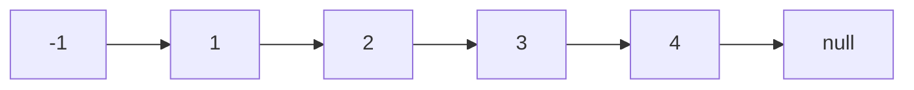

fast先动**2**轮

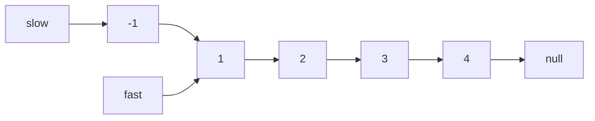

fast动到null slow动到要删除的位子 pre是slow前一个

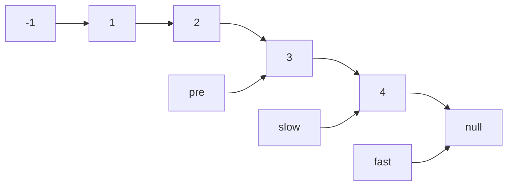


```java
/**
 * Definition for singly-linked list.
 * public class ListNode {
 *     int val;
 *     ListNode next;
 *     ListNode() {}
 *     ListNode(int val) { this.val = val; }
 *     ListNode(int val, ListNode next) { this.val = val; this.next = next; }
 * }
 */
class Solution {
    public ListNode removeNthFromEnd(ListNode head, int n) {

        ListNode dummyNode = new ListNode(-1, head);
        ListNode fast = dummyNode;
        ListNode slow = dummyNode;
        
        for(int i=0; i<n; i++){
            fast = fast.next;
        }        
        ListNode pre = null;
        while(fast != null){
            pre = slow;
            fast = fast.next;
            slow = slow.next;
        }
        
        
        pre.next = slow.next;
        slow.next = null;
        
        
        return dummyNode.next;
        
        
    }
}
```

## 160. Intersection of Two Linked Lists

Given the heads of two singly linked-lists `headA` and `headB`, return *the node at which the two lists intersect*. If the two linked lists have no intersection at all, return `null`.

For example, the following two linked lists begin to intersect at node `c1`:


The test cases are generated such that there are no cycles anywhere in the entire linked structure.

**Note** that the linked lists must **retain their original structure** after the function returns.

**Custom Judge:**

The inputs to the **judge** are given as follows (your program is **not** given these inputs):

- `intersectVal` - The value of the node where the intersection occurs. This is `0` if there is no intersected node.
- `listA` - The first linked list.
- `listB` - The second linked list.
- `skipA` - The number of nodes to skip ahead in `listA` (starting from the head) to get to the intersected node.
- `skipB` - The number of nodes to skip ahead in `listB` (starting from the head) to get to the intersected node.

The judge will then create the linked structure based on these inputs and pass the two heads, `headA` and `headB` to your program. If you correctly return the intersected node, then your solution will be **accepted**.

 

**Example 1:**


```
Input: intersectVal = 8, listA = [4,1,8,4,5], listB = [5,6,1,8,4,5], skipA = 2, skipB = 3
Output: Intersected at '8'
Explanation: The intersected node's value is 8 (note that this must not be 0 if the two lists intersect).
From the head of A, it reads as [4,1,8,4,5]. From the head of B, it reads as [5,6,1,8,4,5]. There are 2 nodes before the intersected node in A; There are 3 nodes before the intersected node in B.
```

**Example 2:**


```
Input: intersectVal = 2, listA = [1,9,1,2,4], listB = [3,2,4], skipA = 3, skipB = 1
Output: Intersected at '2'
Explanation: The intersected node's value is 2 (note that this must not be 0 if the two lists intersect).
From the head of A, it reads as [1,9,1,2,4]. From the head of B, it reads as [3,2,4]. There are 3 nodes before the intersected node in A; There are 1 node before the intersected node in B.
```

**Example 3:**


```
Input: intersectVal = 0, listA = [2,6,4], listB = [1,5], skipA = 3, skipB = 2
Output: No intersection
Explanation: From the head of A, it reads as [2,6,4]. From the head of B, it reads as [1,5]. Since the two lists do not intersect, intersectVal must be 0, while skipA and skipB can be arbitrary values.
Explanation: The two lists do not intersect, so return null.
```

### Solution:

计算两个链表的差值，之后fast挪动差值，再找相同。

```java
/**
 * Definition for singly-linked list.
 * public class ListNode {
 *     int val;
 *     ListNode next;
 *     ListNode(int x) {
 *         val = x;
 *         next = null;
 *     }
 * }
 */
public class Solution {
    public ListNode getIntersectionNode(ListNode headA, ListNode headB) {
        ListNode A = headA;
        ListNode B = headB;
        
        int lenA = 0;
        int lenB =0;
        
        while(A!=null){
            lenA++;
            A = A.next;
        }
        while(B!=null){
            lenB++;
            B = B.next;
        }
        
        int dif = lenA - lenB;
        if(dif<0){
            A = headB;
            B = headA;
            dif = dif*-1;
        }else{
            A = headA;
            B = headB;
        }

        for(int i=0; i<dif ;i++){
            A = A.next;
        }
        
        while(A!=null){
            
            if(A == B){
                return A;
            }
            A = A.next;
            B = B.next;
        }
        
        return null;
    }
}
```

## 142. Linked List Cycle II

Given the `head` of a linked list, return *the node where the cycle begins. If there is no cycle, return* `null`.

There is a cycle in a linked list if there is some node in the list that can be reached again by continuously following the `next` pointer. Internally, `pos` is used to denote the index of the node that tail's `next` pointer is connected to (**0-indexed**). It is `-1` if there is no cycle. **Note that** `pos` **is not passed as a parameter**.

**Do not modify** the linked list.

 

**Example 1:**


```
Input: head = [3,2,0,-4], pos = 1
Output: tail connects to node index 1
Explanation: There is a cycle in the linked list, where tail connects to the second node.
```

**Example 2:**


```
Input: head = [1,2], pos = 0
Output: tail connects to node index 0
Explanation: There is a cycle in the linked list, where tail connects to the first node.
```

**Example 3:**


```
Input: head = [1], pos = -1
Output: no cycle
Explanation: There is no cycle in the linked list.
```

 

**Constraints:**

- The number of the nodes in the list is in the range `[0, 104]`.
- `-105 <= Node.val <= 105`
- `pos` is `-1` or a **valid index** in the linked-list.

### Solution

fast指针比slow指针快一步，这样就能相遇

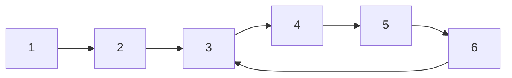


```java
/**
 * Definition for singly-linked list.
 * class ListNode {
 *     int val;
 *     ListNode next;
 *     ListNode(int x) {
 *         val = x;
 *         next = null;
 *     }
 * }
 */
public class Solution {
    public ListNode detectCycle(ListNode head) {
        ListNode fast = head;
        ListNode slow = head;
        
        if( head == null ){
            return null;
        }
        
        while(fast!= null && fast.next !=null){
            
            fast = fast.next.next;
            slow = slow.next;
            if(fast == slow){
                ListNode index1 = head;
                ListNode index2 = fast;
                while(index1 != index2){
                    index1 = index1.next;
                    index2 = index2.next;
                }
                return index1;
            }
            
        }
    
        return null;
    }
}
```

## [extra]21. Merge Two Sorted Lists

```java
/**
 * Definition for singly-linked list.
 * public class ListNode {
 *     int val;
 *     ListNode next;
 *     ListNode() {}
 *     ListNode(int val) { this.val = val; }
 *     ListNode(int val, ListNode next) { this.val = val; this.next = next; }
 * }
 */
class Solution {
    public ListNode mergeTwoLists(ListNode list1, ListNode list2) {

        if(list1==null&&list2==null){
            return null;
        }
        
        if(list1==null&&list2!=null){
            return list2;
        }
        
        if(list1!=null&&list2==null){
            return list1;
        }

    
        ListNode cur2 = list2;
        ListNode dummyNode = new ListNode(-1,list1);
        ListNode pre = dummyNode;
        ListNode cur = list1;
        
        while(cur!=null && cur2!=null){
            

            if(cur2.val<=cur.val){
                
                ListNode node = new ListNode(cur2.val, cur);
                pre.next = node;
                //node.next = cur;
                
                cur2 = cur2.next;
                pre = pre.next;
            }else{
                cur = cur.next;
                pre = pre.next;
            }
            
            
        }
        
        if(cur2!=null){
            pre.next = cur2;
        }
        
        
        return dummyNode.next;
    }
}
```


# 3.Hash Table

##  242. Valid Anagram

Given two strings `s` and `t`, return `true` *if* `t` *is an anagram of* `s`*, and* `false` *otherwise*.

An **Anagram** is a word or phrase formed by rearranging the letters of a different word or phrase, typically using all the original letters exactly once.

## 1002.Find Common Characters

Given a string array `words`, return *an array of all characters that show up in all strings within the* `words` *(including duplicates)*. You may return the answer in **any order**.

**Example 1:**

```
Input: words = ["bella","label","roller"]
Output: ["e","l","l"]
Input: s = "anagram", t = "nagaram"
Output: true
```

**Example 2:**

```
Input: words = ["cool","lock","cook"]
Output: ["c","o"]
```

### Solution

```java
class Solution {
    public List<String> commonChars(String[] words) {
         
        int[] aph = new int[26];
        
        
        if(words == null){
            return null;
        }
        
        String firstStr = words[0];
        for(int i=0; i<firstStr.length();i++){
            aph[firstStr.charAt(i)-'a']++;  
        }     
        
        
        for(String str : words){
            
            int[] temp = new int[26];
            for(int i=0; i<str.length();i++){    
                temp[str.charAt(i)-'a']++;       
            }  
            
            for(int k=0; k<26; k++){
                aph[k] = Math.min(temp[k],aph[k]);
            }
            //aph[str.charAt(i)-'a'] = Math.min(temp[str.charAt(i)-'a'],aph[str.charAt(i)-'a']);
         }   
        
        List<String> result = new ArrayList<>();
        
        for( int i=0; i<26; i++){
            
            while(aph[i]!=0){
                char c = (char)(i+'a');
                String str = String.valueOf(c);
                result.add(str);
                aph[i] --;
            }
        }
        return result;
        
    }

```

## 202.Happy Number

Write an algorithm to determine if a number `n` is happy.

A **happy number** is a number defined by the following process:

- Starting with any positive integer, replace the number by the sum of the squares of its digits.
- Repeat the process until the number equals 1 (where it will stay), or it **loops endlessly in a cycle** which does not include 1.
- Those numbers for which this process **ends in 1** are happy.

Return `true` *if* `n` *is a happy number, and* `false` *if not*.

 

**Example 1:**

```
Input: n = 19
Output: true
Explanation:
12 + 92 = 82
82 + 22 = 68
62 + 82 = 100
12 + 02 + 02 = 1
```

**Example 2:**

```
Input: n = 2
Output: false
```

### Solution

```java
class Solution {
    public boolean isHappy(int n) {
        
        Set<Integer> record = new HashSet<>();
        
        while(!record.contains(n) ){
            
            record.add(n);
            n = cal(n);
            
            if(n == 1){
                return true;
            }
        }
        
        return false;
        
        

    }
    
        private int cal(int n){
            int sum = 0;
            int temp = 0;
            while(n!=0){
                temp = (n%10)*(n%10);
                sum += temp;
                n = n/10;
            }
            
            return sum;
        }
}
```

## 349.Intersection of Two Arrays

Given two integer arrays `nums1` and `nums2`, return *an array of their intersection*. Each element in the result must be **unique** and you may return the result in **any order**.

**Example 1:**

```
Input: nums = [2,7,11,15], target = 9
Output: [0,1]
Explanation: Because nums[0] + nums[1] == 9, we return [0, 1].

Input: nums1 = [1,2,2,1], nums2 = [2,2]
Output: [2]
```

**Example 2:**

```
Input: nums = [3,2,4], target = 6
Output: [1,2]
```

**Example 3:**

```
Input: nums = [3,3], target = 6
Output: [0,1]
```

 

**Constraints:**

- `2 <= nums.length <= 104`
- `-109 <= nums[i] <= 109`
- `-109 <= target <= 109`
- **Only one valid answer exists.**


### Solution:

```java
class Solution {
    public int[] intersection(int[] nums1, int[] nums2) {
        Set<Integer> set1 = new HashSet<>();
        Set<Integer> output = new HashSet<>();
        
        if(nums1 == null || nums2 == null){
            return null;
        }
        
        for(int i : nums1){
            set1.add(i);
        }
        
        for(int i : nums2){
            if(set1.contains(i)){
                output.add(i);
            }
        }
        
        int[] res = new int[output.size()];
        int j=0;
        for(int i : output){
            res[j] = i;
            j ++;
        }
        
        return res;
    }
}
```

## 1.Two Sum

Given an array of integers `nums` and an integer `target`, return *indices of the two numbers such that they add up to `target`*.

You may assume that each input would have ***exactly\* one solution**, and you may not use the *same* element twice.

You can return the answer in any order.

### Solution

```java
class Solution {
    public int[] twoSum(int[] nums, int target) {
        
        int[] res = new int[2];
        if( nums==null || nums.length==0){
            return res;
        }
        
        Map<Integer, Integer> map = new HashMap<>();
        
        for(int i=0; i<nums.length; i++){
            
            int temp = target - nums[i];
            
            if(map.containsKey(temp)){
                res[0] = i;
                res[1] = map.get(temp);
            }
            
            map.put(nums[i],i);
            
        }
        
        return res;
    }
}
```

## 454. 4Sum II

Given four integer arrays `nums1`, `nums2`, `nums3`, and `nums4` all of length `n`, return the number of tuples `(i, j, k, l)` such that:

- `0 <= i, j, k, l < n`
- `nums1[i] + nums2[j] + nums3[k] + nums4[l] == 0`

 

**Example 1:**

```
Input: nums1 = [1,2], nums2 = [-2,-1], nums3 = [-1,2], nums4 = [0,2]
Output: 2
Explanation:
The two tuples are:
1. (0, 0, 0, 1) -> nums1[0] + nums2[0] + nums3[0] + nums4[1] = 1 + (-2) + (-1) + 2 = 0
2. (1, 1, 0, 0) -> nums1[1] + nums2[1] + nums3[0] + nums4[0] = 2 + (-1) + (-1) + 0 = 0
```

**Example 2:**

```
Input: nums1 = [0], nums2 = [0], nums3 = [0], nums4 = [0]
Output: 1
```

 

**Constraints:**

- `n == nums1.length`
- `n == nums2.length`
- `n == nums3.length`
- `n == nums4.length`
- `1 <= n <= 200`
- `-228 <= nums1[i], nums2[i], nums3[i], nums4[i] <= 228`

### Solution:

nums1 = [1,2]

nums2 = [-2,-1]

1. temp = 1-2 = -1

   map{ [-1,1]  }

2. temp = 1-1=0

   Map{ [-1,1], [0, 1]}

   ``

接下来后面两个数字只和 temp

判断0-temp有几个加给count

```java a
class Solution {
    public int fourSumCount(int[] nums1, int[] nums2, int[] nums3, int[] nums4) {
        
        Map<Integer, Integer> map = new HashMap<>();
        int count = 0;
        
        for(int i: nums1){
            for(int j : nums2){
                
                int temp = i+j;
                if(!map.containsKey(temp)){
                    
                    map.put(temp,1);
                }else{
                    map.put(temp,map.get(temp)+1);
                }
                
            }
        }
        
        for(int i : nums3){
            for(int j: nums4){
                
                int temp = i+j;
                if(map.containsKey(0-temp)){
                    count += map.get(0-temp);
                }
            }
        }
        
        return count;
    }
}
```

## 383. Ransom Note

Given two strings `ransomNote` and `magazine`, return `true` *if* `ransomNote` *can be constructed from* `magazine` *and* `false` *otherwise*.

Each letter in `magazine` can only be used once in `ransomNote`.

 

**Example 1:**

```
Input: ransomNote = "a", magazine = "b"
Output: false
```

**Example 2:**

```
Input: ransomNote = "aa", magazine = "ab"
Output: false
```

**Example 3:**

```
Input: ransomNote = "aa", magazine = "aab"
Output: true
```

 

**Constraints:**

- `1 <= ransomNote.length, magazine.length <= 105`
- `ransomNote` and `magazine` consist of lowercase English letters.

### Solution

```java
class Solution {
    public boolean canConstruct(String ransomNote, String magazine) {
        
        int[] record = new int[26];
        
        for(int i=0; i<ransomNote.length(); i++){
            record[ransomNote.charAt(i)-'a']++;
        }
        
        for(int i=0; i<magazine.length(); i++){
            record[magazine.charAt(i)-'a']--;
        }
        
        for(int i=0; i<record.length; i++){
            if(record[i]>0){
                return false;
            }
        }
        return true;
      
```

## 15. 3Sum

Given an integer array nums, return all the triplets `[nums[i], nums[j], nums[k]]` such that `i != j`, `i != k`, and `j != k`, and `nums[i] + nums[j] + nums[k] == 0`.

Notice that the solution set must not contain duplicate triplets.

 

**Example 1:**

```
Input: nums = [-1,0,1,2,-1,-4]
Output: [[-1,-1,2],[-1,0,1]]
```

**Example 2:**

```
Input: nums = []
Output: []
```

**Example 3:**

```
Input: nums = [0]
Output: []
```

 

**Constraints:**

- `0 <= nums.length <= 3000`
- `-105 <= nums[i] <= 105`

### Solution

```java
class Solution {
    public List<List<Integer>> threeSum(int[] nums) {
        
        List<List<Integer>> res = new ArrayList<>();
        
        if(nums.length == 0 || nums == null){
            return res;
        }
        
        Arrays.sort(nums);
        
        for(int i=0; i<nums.length; i++){
            
            if(nums[i]>0){
                return res;
            }
            
            if(i>0 && nums[i]==nums[i-1]){
                continue;
            }
            
            int left = i+1;
            int right = nums.length-1;
            
            while(left<right){
                
                int sum = nums[left] + nums[right] + nums[i];
                if(sum>0){
                    right --;
                }else if(sum<0){
                    left ++;
                }else{
                    res.add(Arrays.asList(nums[i],nums[left],nums[right]));
                     
                
                while (right > left && nums[right] == nums[right - 1]) right--;
                while (right > left && nums[left] == nums[left + 1]) left++;
                
                
                right --;
                left ++;
                }
            }
        }
        return res;
    }
}
```

## 18 4Sum

Given an array `nums` of `n` integers, return *an array of all the **unique** quadruplets* `[nums[a], nums[b], nums[c], nums[d]]` such that:

- `0 <= a, b, c, d < n`
- `a`, `b`, `c`, and `d` are **distinct**.
- `nums[a] + nums[b] + nums[c] + nums[d] == target`

You may return the answer in **any order**.

 

**Example 1:**

```
Input: nums = [1,0,-1,0,-2,2], target = 0
Output: [[-2,-1,1,2],[-2,0,0,2],[-1,0,0,1]]
```

**Example 2:**

```
Input: nums = [2,2,2,2,2], target = 8
Output: [[2,2,2,2]]
```

 

**Constraints:**

- `1 <= nums.length <= 200`
- `-109 <= nums[i] <= 109`
- `-109 <= target <= 109`

### Solution

```java
class Solution {
    public List<List<Integer>> fourSum(int[] nums, int target) {
        List<List<Integer>> res = new ArrayList<>();
        
        if(nums.length==0 || nums.length == 0){
            return res;
        }
        
        Arrays.sort(nums);
        
        for(int i=0; i<nums.length; i++){
            
            if(i>0 && nums[i]==nums[i-1]){
                continue;
            }
            
            for(int j=i+1; j<nums.length; j++){
                
                if(j>i+1 && nums[j]==nums[j-1]){
                    continue;
                }
                
                int left = j+1;
                int right = nums.length - 1;
                
                while(left < right){
                    
                    int sum = nums[i]+nums[j]+nums[left]+nums[right];
                    
                    if(sum>target){
                        right--;
                    }else if(sum<target){
                        left ++;
                    }else{
                        res.add(Arrays.asList(nums[i],nums[j],nums[left],nums[right]));
                        
                        while(left<right && nums[right]==nums[right-1]) right--;
                        while(left<right && nums[left]==nums[left+1]) left++;
                        
                        right --;
                        left ++;
                        
                    }
                    
                }
                
            }
            
        }
        
        return res;
        
    }
}
```

# 4. String

### 344. Reverse String

Write a function that reverses a string. The input string is given as an array of characters `s`.

You must do this by modifying the input array [in-place](https://en.wikipedia.org/wiki/In-place_algorithm) with `O(1)` extra memory.

 

**Example 1:**

```
Input: s = ["h","e","l","l","o"]
Output: ["o","l","l","e","h"]
```

**Example 2:**

```
Input: s = ["H","a","n","n","a","h"]
Output: ["h","a","n","n","a","H"]
```

 

**Constraints:**

- `1 <= s.length <= 105`
- `s[i]` is a [printable ascii character](https://en.wikipedia.org/wiki/ASCII#Printable_characters).

#### Solution

双指针过于简单不再赘述

```java
class Solution {
    public void reverseString(char[] s) {
        
        int left = 0;
        int right = s.length-1;
        
        while(left<right){
            
            char temp = s[left];
            s[left] = s[right];
            s[right] = temp;
            
            left++;
            right--;
            
        }
        
    }
}
```


### 20. Valid Parentheses

Given a string `s` containing just the characters `'('`, `')'`, `'{'`, `'}'`, `'['` and `']'`, determine if the input string is valid.

An input string is valid if:

1. Open brackets must be closed by the same type of brackets.
2. Open brackets must be closed in the correct order.

 

**Example 1:**

```
Input: s = "()"
Output: true
```

**Example 2:**

```
Input: s = "()[]{}"
Output: true
```

**Example 3:**

```
Input: s = "(]"
Output: false
```

**Constraints:**

- `1 <= s.length <= 104`
- `s` consists of parentheses only `'()[]{}'`.

#### Solution

```java
class Solution {
    public boolean isValid(String s) {
        
        Stack<Character> stack = new Stack<>();
        
        /*if(s==null){
            return false;
        }
        
        if(s.length()==0){
            return false;
        }*/
        
        for(int i = 0; i<s.length(); i++){
            
            /*if(i==0){
                stack.push(s.charAt(i)); 
                continue;
            }*/
            
            
            if(!stack.isEmpty()&&stack.peek()=='('&&s.charAt(i)==')'){
                stack.pop();
                continue;
            }else if(!stack.isEmpty()&&stack.peek()=='{'&&s.charAt(i)=='}'){
                stack.pop();
                continue;
            }else if(!stack.isEmpty()&&stack.peek()=='['&&s.charAt(i)==']'){
                stack.pop();
                continue;    
            }else{
               stack.push(s.charAt(i)); 
            }

            
        }
        
        if(stack.isEmpty()){
            return true;
        }else{
            return false;
        }
        
        
    }
}
```

# 5 Double pointers

## 42 Trapping Rain Water

Given `n` non-negative integers representing an elevation map where the width of each bar is `1`, compute how much water it can trap after raining.

 

**Example 1:**


```
Input: height = [0,1,0,2,1,0,1,3,2,1,2,1]
Output: 6
Explanation: The above elevation map (black section) is represented by array [0,1,0,2,1,0,1,3,2,1,2,1]. In this case, 6 units of rain water (blue section) are being trapped.
```

**Example 2:**

```
Input: height = [4,2,0,3,2,5]
Output: 9
```

 

**Constraints:**

- `n == height.length`
- `1 <= n <= 2 * 104`
- `0 <= height[i] <= 105`

#### **Solution**

双指针法，确定每个位子的左右两边最大值，并且比较他的最小值

```java
class Solution {
    public int trap(int[] height) {
        
        int count = 0;
        for(int i = 0; i<height.length; i++){
            
            if(i>0 && i<height.length-1){
                
                //int left = i-1;
                //int right = i+1;
                int leftMax = 0;
                int rightMax = 0;
                
                for(int left = i-1; left>=0; left--){
                    if(height[left]>leftMax){
                        leftMax = height[left];
                    }
                }
                
                for(int right = i+1; right<height.length; right++){
                    if(height[right]>rightMax){
                        rightMax = height[right];
                    }
                }
                
                int temp = Math.min(leftMax,rightMax)-height[i];
                if(temp<0){
                    temp = 0;
                }
                count += temp;
                
                
            }
            
        }
        
        return count;
    }
}
```


# 6. Stack and Queue

## 232. Implement Queue using Stacks

Implement a first in first out (FIFO) queue using only two stacks. The implemented queue should support all the functions of a normal queue (`push`, `peek`, `pop`, and `empty`).

Implement the `MyQueue` class:

- `void push(int x)` Pushes element x to the back of the queue.
- `int pop()` Removes the element from the front of the queue and returns it.
- `int peek()` Returns the element at the front of the queue.
- `boolean empty()` Returns `true` if the queue is empty, `false` otherwise.

**Notes:**

- You must use **only** standard operations of a stack, which means only `push to top`, `peek/pop from top`, `size`, and `is empty` operations are valid.
- Depending on your language, the stack may not be supported natively. You may simulate a stack using a list or deque (double-ended queue) as long as you use only a stack's standard operations.

 

**Example 1:**

```
Input
["MyQueue", "push", "push", "peek", "pop", "empty"]
[[], [1], [2], [], [], []]
Output
[null, null, null, 1, 1, false]

Explanation
MyQueue myQueue = new MyQueue();
myQueue.push(1); // queue is: [1]
myQueue.push(2); // queue is: [1, 2] (leftmost is front of the queue)
myQueue.peek(); // return 1
myQueue.pop(); // return 1, queue is [2]
myQueue.empty(); // return false
```

### Solution:

```java
class MyQueue {

    
    Stack<Integer> in;
    Stack<Integer> out;
    
    public MyQueue() {
        
        in = new Stack<>();
        out = new Stack<>();
    }
    
    public void push(int x) {
        in.push(x);
    }
    
    public int pop() {
        
        copyIn();
        return out.pop();
        
    }
    
    public int peek() {
        copyIn();
        return out.peek();
        
    }
    
    public boolean empty() {
        if(in.empty()&& out.empty()){
            return true;
        }else{
            return false;
        }
    }
    
    public void copyIn(){
        
        if(!out.empty()){
            return;
        }
        
        while(!in.empty()){
            out.push(in.pop());
        }
        
    }
    
}

/**
 * Your MyQueue object will be instantiated and called as such:
 * MyQueue obj = new MyQueue();
 * obj.push(x);
 * int param_2 = obj.pop();
 * int param_3 = obj.peek();
 * boolean param_4 = obj.empty();
 */
```


### 1047 Remove All Adjacent Duplicates In String

You are given a string `s` consisting of lowercase English letters. A **duplicate removal** consists of choosing two **adjacent** and **equal** letters and removing them.

We repeatedly make **duplicate removals** on `s` until we no longer can.

Return *the final string after all such duplicate removals have been made*. It can be proven that the answer is **unique**.

 

**Example 1:**

```
Input: s = "abbaca"
Output: "ca"
Explanation: 
For example, in "abbaca" we could remove "bb" since the letters are adjacent and equal, and this is the only possible move.  The result of this move is that the string is "aaca", of which only "aa" is possible, so the final string is "ca".
```

**Example 2:**

```
Input: s = "azxxzy"
Output: "ay"
```

 

**Constraints:**

- `1 <= s.length <= 105`
- `s` consists of lowercase English letters.

#### Solution

```java
class Solution {
    public String removeDuplicates(String s) {
        
        Stack<Character> stack = new Stack<>();
        
        for(int i=0; i<s.length(); i++){
            
            char ch = s.charAt(i);
            
            if(!stack.isEmpty()&&stack.peek()==ch){
                stack.pop();
            }else{
                stack.push(ch);
            }
        }
        
        String res = "";
        while(!stack.isEmpty()){
            res = stack.pop() + res;
        }
        
        return res;
        
    }
}
```

更简洁的一种写法

```java
class Solution {
    public String removeDuplicates(String s) {
        
        Stack<Character> stack = new Stack<>();
        
        for(int i =0; i<s.length(); i++){
            
            char ch = s.charAt(i);
            
            if(stack.isEmpty()||stack.peek()!=ch){
                stack.push(ch);
            }else{
                stack.pop();
            }
        }
        
        String res = "";
        while(!stack.isEmpty()){
            res = stack.pop()+res;
        }
        return res;
    }
}
```

### 150 Evaluate Reverse Polish Notation

Evaluate the value of an arithmetic expression in [Reverse Polish Notation](http://en.wikipedia.org/wiki/Reverse_Polish_notation).

Valid operators are `+`, `-`, `*`, and `/`. Each operand may be an integer or another expression.

**Note** that division between two integers should truncate toward zero.

It is guaranteed that the given RPN expression is always valid. That means the expression would always evaluate to a result, and there will not be any division by zero operation.

 

**Example 1:**

```
Input: tokens = ["2","1","+","3","*"]
Output: 9
Explanation: ((2 + 1) * 3) = 9
```

**Example 2:**

```
Input: tokens = ["4","13","5","/","+"]
Output: 6
Explanation: (4 + (13 / 5)) = 6
```

**Example 3:**

```
Input: tokens = ["10","6","9","3","+","-11","*","/","*","17","+","5","+"]
Output: 22
Explanation: ((10 * (6 / ((9 + 3) * -11))) + 17) + 5
= ((10 * (6 / (12 * -11))) + 17) + 5
= ((10 * (6 / -132)) + 17) + 5
= ((10 * 0) + 17) + 5
= (0 + 17) + 5
= 17 + 5
= 22
```

 

**Constraints:**

- `1 <= tokens.length <= 104`
- `tokens[i]` is either an operator: `"+"`, `"-"`, `"*"`, or `"/"`, or an integer in the range `[-200, 200]`.

#### **Solution**

```java
class Solution {
    public int evalRPN(String[] tokens) {
        Deque<Integer> stack = new LinkedList<>();
        
        for(int i=0; i<tokens.length; i++){
            
            
            if(tokens[i].equals("+") || tokens[i].equals("-")||tokens[i].equals("*")||tokens[i].equals("/")){
                
                int a = stack.peek();
                stack.pop();
                int b = stack.peek();
                stack.pop();

                
                if(tokens[i].equals("+")){
                    int c = b+a;
                    stack.push(c);
                }else if(tokens[i].equals("-")){
                    int c = b-a;
                    stack.push(c);
                }else if(tokens[i].equals("*")){
                    int c = b*a;
                    stack.push(c);
                }else if(tokens[i].equals("/")){
                    int c = b/a;
                    stack.push(c);
                }
                
            }else{
                String t = tokens[i];
                int temp = Integer.valueOf(t);
                stack.push(temp);
            }
            
        }
        
        return stack.peek();
    }
}
```

### 239 Sliding Window Maximus

暴力法

```java
class Solution {
    public int[] maxSlidingWindow(int[] nums, int k) {
        
        int left = 0;
        int right = left+k-1;
        
        int[]res = new int[nums.length-k+1];
        
        while(right<nums.length){
            
            int max = nums[left];
            for(int i =left; i<=right; i++){
                
                if(nums[i]>=max){
                    max = nums[i];
                }
            }
            res[left] = max;
            
            
            left++;
            right++;
        }

        return res;
    }
}
```

# 7. Binary Tree

## [144. 二叉树的前序遍历](https://leetcode-cn.com/problems/binary-tree-preorder-traversal/)

难度简单775收藏分享切换为英文接收动态反馈

给你二叉树的根节点 `root` ，返回它节点值的 **前序** 遍历。

 

**示例 1：**


```
输入：root = [1,null,2,3]
输出：[1,2,3]
```

**示例 2：**

```
输入：root = []
输出：[]
```

**示例 3：**

```
输入：root = [1]
输出：[1]
```

**示例 4：**


```
输入：root = [1,2]
输出：[1,2]
```

**示例 5：**


```
输入：root = [1,null,2]
输出：[1,2]
```

 

**提示：**

- 树中节点数目在范围 `[0, 100]` 内
- `-100 <= Node.val <= 100`

### Solution

前序遍历从root到left， left视为root，直到走完，再走right


首先访问A

之后访问B

再访问D

之后E

之后C

之后F

```java
/**
 * Definition for a binary tree node.
 * public class TreeNode {
 *     int val;
 *     TreeNode left;
 *     TreeNode right;
 *     TreeNode() {}
 *     TreeNode(int val) { this.val = val; }
 *     TreeNode(int val, TreeNode left, TreeNode right) {
 *         this.val = val;
 *         this.left = left;
 *         this.right = right;
 *     }
 * }
 */
class Solution {
    public List<Integer> preorderTraversal(TreeNode root) {

        ArrayList<Integer> res = new ArrayList<>();
        preOrder(root, res);

        return res;


    }
            void preOrder(TreeNode root, ArrayList<Integer> res){

            if(root == null){
                return;
            }
            res.add(root.val);
            preOrder(root.left, res);
            preOrder(root.right, res);

        }
}
```

## [145. 二叉树的后序遍历](https://leetcode-cn.com/problems/binary-tree-postorder-traversal/)

难度简单794收藏分享切换为英文接收动态反馈

给你一棵二叉树的根节点 `root` ，返回其节点值的 **后序遍历** 。

 

**示例 1：**


```
输入：root = [1,null,2,3]
输出：[3,2,1]
```

**示例 2：**

```
输入：root = []
输出：[]
```

**示例 3：**

```
输入：root = [1]
输出：[1]
```

 

**提示：**

- 树中节点的数目在范围 `[0, 100]` 内
- `-100 <= Node.val <= 100`

### Solution

后序遍历


DEBFCA

```java
/**
 * Definition for a binary tree node.
 * public class TreeNode {
 *     int val;
 *     TreeNode left;
 *     TreeNode right;
 *     TreeNode() {}
 *     TreeNode(int val) { this.val = val; }
 *     TreeNode(int val, TreeNode left, TreeNode right) {
 *         this.val = val;
 *         this.left = left;
 *         this.right = right;
 *     }
 * }
 */
class Solution {
    public List<Integer> postorderTraversal(TreeNode root) {
        
        ArrayList<Integer> res = new ArrayList<>();
        postOrder(root, res);

        return res;

    }

    void postOrder(TreeNode root, ArrayList<Integer> res){

        if(root==null){
            return;
        }

        postOrder(root.left, res);
        postOrder(root.right, res);
        res.add(root.val);
    }
}
```

## [94. 二叉树的中序遍历](https://leetcode-cn.com/problems/binary-tree-inorder-traversal/)

难度简单1343收藏分享切换为英文接收动态反馈

给定一个二叉树的根节点 `root` ，返回 *它的 **中序** 遍历* 。

 

**示例 1：**


```
输入：root = [1,null,2,3]
输出：[1,3,2]
```

**示例 2：**

```
输入：root = []
输出：[]
```

**示例 3：**

```
输入：root = [1]
输出：[1]
```

 

**提示：**

- 树中节点数目在范围 `[0, 100]` 内
- `-100 <= Node.val <= 100`

### Solution


DBEAFC

```java
/**
 * Definition for a binary tree node.
 * public class TreeNode {
 *     int val;
 *     TreeNode left;
 *     TreeNode right;
 *     TreeNode() {}
 *     TreeNode(int val) { this.val = val; }
 *     TreeNode(int val, TreeNode left, TreeNode right) {
 *         this.val = val;
 *         this.left = left;
 *         this.right = right;
 *     }
 * }
 */
class Solution {
    public List<Integer> inorderTraversal(TreeNode root) {
        ArrayList<Integer> res = new ArrayList<>();
        inOrder(root, res);
        return res;
    }

    void inOrder(TreeNode root, ArrayList<Integer> res){

        if(root == null){
            return;
        }

        inOrder(root.left, res);
        res.add(root.val);
        inOrder(root.right, res);


    }
}
```

# 层序遍历合集

Given the `root` of a binary tree, return *the level order traversal of its nodes' values*. (i.e., from left to right, level by level).

 

**Example 1:**


```
Input: root = [3,9,20,null,null,15,7]
Output: [[3],[9,20],[15,7]]
```

**Example 2:**

```
Input: root = [1]
Output: [[1]]
```

**Example 3:**

```
Input: root = []
Output: []
```


**Constraints:**

- The number of nodes in the tree is in the range `[0, 2000]`.
- `-1000 <= Node.val <= 1000`

## 102. Binary Tree Level Order Traversal

### Solution

BFS，通过que代替stack，每层遍历后加入数组

```java
/**
 * Definition for a binary tree node.
 * public class TreeNode {
 *     int val;
 *     TreeNode left;
 *     TreeNode right;
 *     TreeNode() {}
 *     TreeNode(int val) { this.val = val; }
 *     TreeNode(int val, TreeNode left, TreeNode right) {
 *         this.val = val;
 *         this.left = left;
 *         this.right = right;
 *     }
 * }
 */
class Solution {
    public List<List<Integer>> levelOrder(TreeNode root) {
        List<List<Integer>> res = new ArrayList<>();
                
        Queue<TreeNode> que = new LinkedList<>(); 
        
        if(root == null){
            
            return res;
        }
        
        que.add(root);
        
        while(!que.isEmpty()){
            
            ArrayList<Integer>level = new ArrayList<>();
                
            for(int len = que.size(); len>0; len--){
                
                TreeNode node = que.peek();
                que.poll();
                level.add(node.val);
                
                if(node.left != null){
                    que.add(node.left);
                }
                
                if(node.right != null){  
                   que.add(node.right); 
                }
                
                
            }   
            
            res.add(level);
            
        }
        
        return res;
    }
}
```

## 107.Binary Tree Level Order Traversal II

### Solution:

和102完全一致，多一步反转结果list

```java
/**
 * Definition for a binary tree node.
 * public class TreeNode {
 *     int val;
 *     TreeNode left;
 *     TreeNode right;
 *     TreeNode() {}
 *     TreeNode(int val) { this.val = val; }
 *     TreeNode(int val, TreeNode left, TreeNode right) {
 *         this.val = val;
 *         this.left = left;
 *         this.right = right;
 *     }
 * }
 */
class Solution {
    public List<List<Integer>> levelOrderBottom(TreeNode root) {
        
        List<List<Integer>> res = new ArrayList<>();
        
        Queue<TreeNode> que = new LinkedList<>();
        
        if(root == null){
            return res;
        }
        
        que.add(root);
        
        while(!que.isEmpty()){
            
            ArrayList<Integer> level = new ArrayList<>();
            
            for(int len = que.size(); len>0; len--){
                
                TreeNode node = que.peek();
                que.poll();
                level.add(node.val);
                
                if(node.left != null){
                    que.add(node.left);
                }
                
                if(node.right != null){
                    que.add(node.right);
                }
                
                
            }
            
            res.add(level);      
            
        }
        
       Collections.reverse(res);
        
        return res;
        
    }
}
```

## 637. Average of Levels in Binary Tree

### Solution:

```java
/**
 * Definition for a binary tree node.
 * public class TreeNode {
 *     int val;
 *     TreeNode left;
 *     TreeNode right;
 *     TreeNode() {}
 *     TreeNode(int val) { this.val = val; }
 *     TreeNode(int val, TreeNode left, TreeNode right) {
 *         this.val = val;
 *         this.left = left;
 *         this.right = right;
 *     }
 * }
 */
class Solution {
    public List<Double> averageOfLevels(TreeNode root) {
        
        ArrayList<Double> res = new ArrayList<>();
        
        Queue<TreeNode> que = new LinkedList<>();
        
        if(root == null){
            return res;
        }
        
        que.add(root);
        
        while(!que.isEmpty()){
            
            double sum = 0;
            int length = que.size();
            
            for(int len = que.size(); len>0; len--){
                TreeNode node = que.peek();
                que.poll();
                sum += node.val;
                
                if(node.left != null){
                    que.add(node.left);
                }
                if(node.right != null){
                    que.add(node.right);
                }
            }
            
            res.add(sum/=length);
            
        }
        
        return res;
    }
}
```

## 429.N-ary Tree Level Order Traversal

### Solution:

```java
/*
// Definition for a Node.
class Node {
    public int val;
    public List<Node> children;

    public Node() {}

    public Node(int _val) {
        val = _val;
    }

    public Node(int _val, List<Node> _children) {
        val = _val;
        children = _children;
    }
};
*/

class Solution {
    public List<List<Integer>> levelOrder(Node root) {
    
        List<List<Integer>> res = new ArrayList<>();
        
        Queue<Node> que = new LinkedList<>();
        
        if(root == null){
            return res;
        }
        
        que.add(root);
        
        
        while(!que.isEmpty()){
            
            ArrayList<Integer> level = new ArrayList<>();
            
            for(int len= que.size(); len>0; len--){
                Node node = que.peek();
                que.poll();
                
                level.add(node.val);
                
                int count = 0;
                while(node.children != null && count != node.children.size()){
                    //node.children.get(1);
                    que.add(node.children.get(count));
                    count ++;
                }

            }
            
            res.add(level);
            
            
        }
        
        return res;
    }
}
```

## 515. Find Largest Value in Each Tree Row

### Solution:

记住最小值是-Integer.MAX_VALUE-1

```java
/**
 * Definition for a binary tree node.
 * public class TreeNode {
 *     int val;
 *     TreeNode left;
 *     TreeNode right;
 *     TreeNode() {}
 *     TreeNode(int val) { this.val = val; }
 *     TreeNode(int val, TreeNode left, TreeNode right) {
 *         this.val = val;
 *         this.left = left;
 *         this.right = right;
 *     }
 * }
 */
class Solution {
    public List<Integer> largestValues(TreeNode root) {
        
        ArrayList<Integer> res = new ArrayList<>();
        
        Queue<TreeNode> que = new LinkedList<>();
        
        if(root == null){
            return res;
        }
        
        que.add(root);
        
        while(!que.isEmpty()){
            
            int min = -Integer.MAX_VALUE-1;
            
            for(int len=que.size(); len>0; len--){
                
                TreeNode node = que.peek();
                que.poll();
                
                if(node.val>min){
                    min = node.val;
                }
                if(node.left != null){
                    que.add(node.left);
                }
                
                if(node.right != null){
                    que.add(node.right);
                }
                               
            }
            
            res.add(min);
            
        }
        
        return res;
    }
}
```

## 116. Populating Next Right Pointers in Each Node

### Solution

```java
/*
// Definition for a Node.
class Node {
    public int val;
    public Node left;
    public Node right;
    public Node next;

    public Node() {}
    
    public Node(int _val) {
        val = _val;
    }

    public Node(int _val, Node _left, Node _right, Node _next) {
        val = _val;
        left = _left;
        right = _right;
        next = _next;
    }
};
*/

class Solution {
    public Node connect(Node root) {
        
        Queue<Node> que = new LinkedList<>();
        
        if(root != null){
            que.add(root);
        }
        
        while(!que.isEmpty()){
            
            
            for(int len=que.size(); len>0; len--){
                Node tmpNode = que.peek();
                que.poll();
                
                if(tmpNode.left != null){
                    que.add(tmpNode.left);
                }
                
                if(tmpNode.right != null){
                    que.add(tmpNode.right);
                }
                
                if(len==1){
                    tmpNode.next = null;
                }else{
                    tmpNode.next = que.peek();
                }
            }
            
            
        }
        
        
        return root;
    }
}
```

## 117. Populating Next Right Pointers in Each Node II

### Solution

```java
/*
// Definition for a Node.
class Node {
    public int val;
    public Node left;
    public Node right;
    public Node next;

    public Node() {}
    
    public Node(int _val) {
        val = _val;
    }

    public Node(int _val, Node _left, Node _right, Node _next) {
        val = _val;
        left = _left;
        right = _right;
        next = _next;
    }
};
*/

class Solution {
    public Node connect(Node root) {
        
        Queue<Node> que = new LinkedList<>();
        if(root != null){
            que.add(root);
        }else{
            return root;
        }
        
        while(!que.isEmpty()){
            
            for(int len = que.size(); len>0; len--){
                
                Node node = que.poll();
                
                if(node.left != null){
                    que.add(node.left);
                }
                
                if(node.right != null){
                    que.add(node.right);
                }
                
                if(len==1){
                    node.next = null;
                }else{
                    node.next = que.peek();
                }
                
            }
            
        }
        
        return root;
        
    }
}
```

## 111. Minimum Depth of Binary Tree

### Solution

```java
/**
 * Definition for a binary tree node.
 * public class TreeNode {
 *     int val;
 *     TreeNode left;
 *     TreeNode right;
 *     TreeNode() {}
 *     TreeNode(int val) { this.val = val; }
 *     TreeNode(int val, TreeNode left, TreeNode right) {
 *         this.val = val;
 *         this.left = left;
 *         this.right = right;
 *     }
 * }
 */
class Solution {
    public int minDepth(TreeNode root) {
        
        Queue<TreeNode> que = new LinkedList<>();
        
        
        int res = 1;
        
        if(root==null){
            return 0;
        }
        
        if(root!=null){
            que.add(root);
        }
        
        while(!que.isEmpty()){
            
            for(int len=que.size(); len>0; len--){
                
                TreeNode node = que.poll();
                
                if(node.left == null && node.right == null){
                    return res;
                }
                
                if(node.left != null){
                    que.add(node.left);
                }
                
                if(node.right != null){
                    que.add(node.right);
                }
                
            }
            
            res +=1;
        }
        
        
        return res;
        
    }
}
```

## 559. Maximum Depth of N-ary Tree

### Solution

```java
/*
// Definition for a Node.
class Node {
    public int val;
    public List<Node> children;

    public Node() {}

    public Node(int _val) {
        val = _val;
    }

    public Node(int _val, List<Node> _children) {
        val = _val;
        children = _children;
    }
};
*/

class Solution {
    public int maxDepth(Node root) {
        
        int res = 0;
        
        if(root==null){
            return res;
        }  
        
        Queue<Node> que = new LinkedList<>();
        
        que.add(root);
        
        while(!que.isEmpty()){
            
            for(int len = que.size(); len>0; len--){
                
                Node node = que.poll();
                
                
                for(Node n : node.children){
                    
                    if(n!=null){
                        que.add(n);
                    }
                }

            }
            
            res++;
            
        }
        
        return res;
    }
}
```


# 后序遍历判断树是否相同

## 101. Symmetric Tree

**Solution:**

后续遍历，BFS

判断左右节点是否相等

leftNode.val == rightNode.val

que里加leftNode.left, rightNode.right

```java
/**
 * Definition for a binary tree node.
 * public class TreeNode {
 *     int val;
 *     TreeNode left;
 *     TreeNode right;
 *     TreeNode() {}
 *     TreeNode(int val) { this.val = val; }
 *     TreeNode(int val, TreeNode left, TreeNode right) {
 *         this.val = val;
 *         this.left = left;
 *         this.right = right;
 *     }
 * }
 */
class Solution {
    public boolean isSymmetric(TreeNode root) {
        
        Queue<TreeNode> que = new LinkedList<>();
        que.add(root.left);
        que.add(root.right);
        
        while(!que.isEmpty()){
            
            TreeNode leftNode = que.poll();
            TreeNode rightNode = que.poll();
            
            if(leftNode == null && rightNode == null){
                continue;
            }
            
            if(leftNode == null && rightNode != null){
                return false;
            }
            
            if(leftNode != null && rightNode == null){
                return false;
            }
            
            if(leftNode.val != rightNode.val){
                return false;
            }
            
            que.add(leftNode.left);
            que.add(rightNode.right);
            que.add(leftNode.right);
            que.add(rightNode.left);
            
        }
        
        return true;
        
    }
}
```

## 100. Same Tree

```java
/**
 * Definition for a binary tree node.
 * public class TreeNode {
 *     int val;
 *     TreeNode left;
 *     TreeNode right;
 *     TreeNode() {}
 *     TreeNode(int val) { this.val = val; }
 *     TreeNode(int val, TreeNode left, TreeNode right) {
 *         this.val = val;
 *         this.left = left;
 *         this.right = right;
 *     }
 * }
 */
class Solution {
    public boolean isSameTree(TreeNode p, TreeNode q) {
        
        Queue<TreeNode> que = new LinkedList<>();
        que.add(p);
        que.add(q);
        
        while(!que.isEmpty()){
            
            TreeNode leftNode = que.poll();
            TreeNode rightNode = que.poll();
            
            if(leftNode == null && rightNode == null){
                continue;
            }
            
            if(leftNode == null && rightNode != null){
                return false;
            }            
            
            if(leftNode != null && rightNode == null){
                return false;
            }
            
            if(leftNode.val != rightNode.val){
                return false;
            }
            

            
            que.add(leftNode.left);
            que.add(rightNode.left);
            que.add(leftNode.right);
            que.add(rightNode.right);
            
        }
        
        return true;
    }
}
```

## 572. Subtree of Another Tree

先找到origin和subroot相同的值

之后和symmertri tree判断一样

```java
/**
 * Definition for a binary tree node.
 * public class TreeNode {
 *     int val;
 *     TreeNode left;
 *     TreeNode right;
 *     TreeNode() {}
 *     TreeNode(int val) { this.val = val; }
 *     TreeNode(int val, TreeNode left, TreeNode right) {
 *         this.val = val;
 *         this.left = left;
 *         this.right = right;
 *     }
 * }
 */
class Solution {
    public boolean isSubtree(TreeNode root, TreeNode subRoot) {
    
        Queue<TreeNode> que = new LinkedList<>();
        que.add(root);
        
        while(!que.isEmpty()){
            
            TreeNode origin = que.poll();
            
            if(origin!= null && origin.val == subRoot.val ){
                
                if(isSame(origin, subRoot)==true){
                    return true;
                }
                
            }
            
            if(origin.left != null){
                que.add(origin.left);
            }
            if(origin.right!=null){
                que.add(origin.right);
            }
            
        }
        
        return false;
        
    }
    
    public boolean isSame(TreeNode origin, TreeNode subRoot){
        Queue<TreeNode> q = new LinkedList<>();
        q.add(origin);
        q.add(subRoot);
                
        while(!q.isEmpty()){

            TreeNode leftNode = q.poll();
            TreeNode rightNode = q.poll();

            if(leftNode == null && rightNode == null){
                continue;
            }

            if(leftNode == null && rightNode != null){
                return false;
            }            

            if(leftNode != null && rightNode == null){
                return false;
            }

            if(leftNode.val != rightNode.val){
                return false;
            }

            q.add(leftNode.left);
            q.add(rightNode.left);
            q.add(leftNode.right);
            q.add(rightNode.right);

        }
        return true;
    }
}
```

# 

# -------

## 257 Binary Tree Paths

带一丢丢回溯思想？

```java
/**
 * Definition for a binary tree node.
 * public class TreeNode {
 *     int val;
 *     TreeNode left;
 *     TreeNode right;
 *     TreeNode() {}
 *     TreeNode(int val) { this.val = val; }
 *     TreeNode(int val, TreeNode left, TreeNode right) {
 *         this.val = val;
 *         this.left = left;
 *         this.right = right;
 *     }
 * }
 */
class Solution {
    public List<String> binaryTreePaths(TreeNode root) {
    
        List<String> res = new ArrayList<>();
        
        Stack<TreeNode> stack = new Stack<>();
        Stack<String> path = new Stack<>();
        
        if(root == null){
            return res;
        }
        
        stack.push(root);
        path.push(root.val+"");
        
        while(!stack.isEmpty()){
            
            TreeNode node = stack.pop();
            String s = path.pop();
            
            if(node.left==null&&node.right==null){
                res.add(s);
            }
            
            if(node.right!=null){
                stack.push(node.right);
                path.push(s+"->"+node.right.val);
            }
            
            if(node.left!=null){
                stack.push(node.left);
                path.push(s+"->"+node.left.val);
            }            
            
            
        }
        
        return res;
    }
}
```

## 404. Sum of Left Leaves

```java
/**
 * Definition for a binary tree node.
 * public class TreeNode {
 *     int val;
 *     TreeNode left;
 *     TreeNode right;
 *     TreeNode() {}
 *     TreeNode(int val) { this.val = val; }
 *     TreeNode(int val, TreeNode left, TreeNode right) {
 *         this.val = val;
 *         this.left = left;
 *         this.right = right;
 *     }
 * }
 */
class Solution {
    public int sumOfLeftLeaves(TreeNode root) {
        int sum = 0;
        if(root == null){
            return sum;
        }
        
        Stack<TreeNode> stack = new Stack<>();
        stack.push(root);
        
        while(!stack.isEmpty()){
            
            TreeNode node = stack.pop();
            
            if(node.left!=null&&node.left.left==null&&node.left.right==null){
                sum+=node.left.val;
            }
            
            if(node.right!=null){
                stack.push(node.right);
            }
            if(node.left!=null){
                stack.push(node.left);
            }
        }
        
        return sum;
    }
}
```

## 513. Find Bottom Left Tree Value

取值 从right 到left入que

```java
/**
 * Definition for a binary tree node.
 * public class TreeNode {
 *     int val;
 *     TreeNode left;
 *     TreeNode right;
 *     TreeNode() {}
 *     TreeNode(int val) { this.val = val; }
 *     TreeNode(int val, TreeNode left, TreeNode right) {
 *         this.val = val;
 *         this.left = left;
 *         this.right = right;
 *     }
 * }
 */
class Solution {
    public int findBottomLeftValue(TreeNode root) {
        int res = 0;
        
        if(root == null){
            return res;
        }
        
        res = root.val;
        Queue<TreeNode> que = new LinkedList<>();
        que.offer(root);
        while(!que.isEmpty()){
            
            for(int len =que.size(); len>0; len--){
                
                TreeNode node = que.poll();
                res = node.val;
                
                
                if(node.right!=null){
                    que.offer(node.right);
                }
                if(node.left!=null){
                    que.offer(node.left);
                    res = node.left.val;
                }
                
            }
            
            
        }
        return res;
    }
}
```

## 112. Path Sum

（深度遍历）前序遍历

```java
/**
 * Definition for a binary tree node.
 * public class TreeNode {
 *     int val;
 *     TreeNode left;
 *     TreeNode right;
 *     TreeNode() {}
 *     TreeNode(int val) { this.val = val; }
 *     TreeNode(int val, TreeNode left, TreeNode right) {
 *         this.val = val;
 *         this.left = left;
 *         this.right = right;
 *     }
 * }
 */
class Solution {
    public boolean hasPathSum(TreeNode root, int targetSum) {
            
        
        if(root == null){
            return false;    
        }
        
        Stack<TreeNode> stack = new Stack<>();
        Stack<Integer> path = new Stack<>();
        
        stack.push(root);
        path.push(root.val);

        
        while(!stack.isEmpty()){
            
            TreeNode node = stack.pop();
            int sum = path.pop();

            
            if(node.left==null&node.right==null&&sum==targetSum){
                return true;
            }
            
            if(node.right!=null){
                stack.push(node.right);
                path.push(sum+node.right.val);
            }
            
            if(node.left!=null){
                stack.push(node.left);
                path.push(sum+node.left.val);
            }
            
        }
        
        return false;
    }
}
```

## *113

## 617. Merge Two Binary Trees

把右树+给左树

```java
/**
 * Definition for a binary tree node.
 * public class TreeNode {
 *     int val;
 *     TreeNode left;
 *     TreeNode right;
 *     TreeNode() {}
 *     TreeNode(int val) { this.val = val; }
 *     TreeNode(int val, TreeNode left, TreeNode right) {
 *         this.val = val;
 *         this.left = left;
 *         this.right = right;
 *     }
 * }
 */
class Solution {
    public TreeNode mergeTrees(TreeNode root1, TreeNode root2) {
        Queue<TreeNode> que = new LinkedList<>();
        
        if(root1==null){
            return root2;
        }
        
        if(root2 == null){
            return root1;
        }
        
        que.add(root1);
        que.add(root2);
        
        while(!que.isEmpty()){
            
            TreeNode node1 = que.poll();
            TreeNode node2 = que.poll();
            
            node1.val += node2.val;
            
            if(node1.left!=null&&node2.left!=null){
                que.add(node1.left);
                que.add(node2.left);
            }
            
            if(node1.right!=null&&node2.right!=null){
                que.add(node1.right);
                que.add(node2.right);
            }
            
            if(node1.left == null && node2.left!=null){
                node1.left = node2.left;
            }
            
            if(node1.right == null && node2.right != null){
                node1.right = node2.right;
            }
            
            
            
            
            
        }
        
        return root1;
    }
}
```

## 700. Search in a Binary Search Tree

普通法，前序遍历

```java
/**
 * Definition for a binary tree node.
 * public class TreeNode {
 *     int val;
 *     TreeNode left;
 *     TreeNode right;
 *     TreeNode() {}
 *     TreeNode(int val) { this.val = val; }
 *     TreeNode(int val, TreeNode left, TreeNode right) {
 *         this.val = val;
 *         this.left = left;
 *         this.right = right;
 *     }
 * }
 */
class Solution {
    public TreeNode searchBST(TreeNode root, int val) {
        Queue<TreeNode> que = new LinkedList<>();
        
        if(root == null){
            return null;
        }
        que.add(root);
        
        while(!que.isEmpty()){
            
            TreeNode node = que.poll();
            
            if(node.val == val){
                return node;
            }
            
            if(node.left!=null){
                que.add(node.left);
            }
            
            if(node.right!=null){
                que.add(node.right);
            }
            
            
        }
        
        return null;
    }
}
```


# 构建二叉树，后序转前序

## 106. Construct Binary Tree from Inorder and Postorder Traversal

```java
/**
 * Definition for a binary tree node.
 * public class TreeNode {
 *     int val;
 *     TreeNode left;
 *     TreeNode right;
 *     TreeNode() {}
 *     TreeNode(int val) { this.val = val; }
 *     TreeNode(int val, TreeNode left, TreeNode right) {
 *         this.val = val;
 *         this.left = left;
 *         this.right = right;
 *     }
 * }
 */
/*
* 第一步：如果数组大小为零的话，说明是空节点了。

* 第二步：如果不为空，那么取后序数组最后一个元素作为节点元素。

* 第三步：找到后序数组最后一个元素在中序数组的位置，作为切割点

* 第四步：切割中序数组，切成中序左数组和中序右数组 （顺序别搞反了，一定是先切中序数组）

* 第五步：切割后序数组，切成后序左数组和后序右数组

* 第六步：递归处理左区间和右区间

*/
class Solution {
    public TreeNode buildTree(int[] inorder, int[] postorder) {
    
        return build(inorder, 0, inorder.length, postorder, 0, postorder.length);
        
    }
    public TreeNode build(int[] inorder, int inLeft, int inRight, int[]postorder, int postLeft, int postRight){
        
        if(inRight - inLeft <1){
            return null;
        }
        
        if(inRight - inLeft == 1){
            return new TreeNode(inorder[inLeft]);
        }
        
        int rootVal = postorder[postRight-1];
        TreeNode root = new TreeNode(rootVal);
        int index = 0;
        for(int i =inLeft; i<inRight; i++){
            
            if(inorder[i]==root.val){
                index = i;
                break;
            }
        }
        
        root.left = build(inorder, inLeft, index, postorder, postLeft, postLeft+(index-inLeft) );
        root.right = build(inorder, index+1, inRight, postorder, postLeft+(index-inLeft), postRight-1 );
        return root;
    }
}
```

## *105 Construct Binary Tree from Preorder and Inorder Traversal

**二叉树前序遍历的顺序为：**

先遍历根节点；

随后递归地遍历左子树；

最后递归地遍历右子树。

**二叉树中序遍历的顺序为：**

先递归地遍历左子树；

随后遍历根节点；

最后递归地遍历右子树。

```java
/**
 * Definition for a binary tree node.
 * public class TreeNode {
 *     int val;
 *     TreeNode left;
 *     TreeNode right;
 *     TreeNode() {}
 *     TreeNode(int val) { this.val = val; }
 *     TreeNode(int val, TreeNode left, TreeNode right) {
 *         this.val = val;
 *         this.left = left;
 *         this.right = right;
 *     }
 * }
 */
class Solution {
    public TreeNode buildTree(int[] preorder, int[] inorder) {
        return helper(preorder, 0, preorder.length - 1, inorder, 0, inorder.length - 1);
    }

    public TreeNode helper(int[] preorder, int preLeft, int preRight,
                           int[] inorder, int inLeft, int inRight) {
        // 递归终止条件
        if (inLeft > inRight || preLeft > preRight) return null;

        // val 为前序遍历第一个的值，也即是根节点的值
        // idx 为根据根节点的值来找中序遍历的下标
        int idx = inLeft, val = preorder[preLeft];
        TreeNode root = new TreeNode(val);
        for (int i = inLeft; i <= inRight; i++) {
            if (inorder[i] == val) {
                idx = i;
                break;
            }
        }

        // 根据 idx 来递归找左右子树
        root.left = helper(preorder, preLeft + 1, preLeft + (idx - inLeft),
                         inorder, inLeft, idx - 1);
        root.right = helper(preorder, preLeft + (idx - inLeft) + 1, preRight,
                         inorder, idx + 1, inRight);
        return root;
    }
}
```

## 654. Maximum Binary Tree

```java
/**
 * Definition for a binary tree node.
 * public class TreeNode {
 *     int val;
 *     TreeNode left;
 *     TreeNode right;
 *     TreeNode() {}
 *     TreeNode(int val) { this.val = val; }
 *     TreeNode(int val, TreeNode left, TreeNode right) {
 *         this.val = val;
 *         this.left = left;
 *         this.right = right;
 *     }
 * }
 */
class Solution {
    public TreeNode constructMaximumBinaryTree(int[] nums) {
        
        return build(nums, 0, nums.length);
    }
    
    public TreeNode build(int[]nums, int left, int right){
        
        if(right-left<1){
            return null;
        }
        if(right-left==1){
            return new TreeNode(nums[left]);
        }
        
        
        int index = 0;
        int maxVal = 0;
        for(int i = left; i<right; i++){
            if(nums[i]>maxVal){
                maxVal = nums[i];
                index = i;
            }    
        }
        
        TreeNode root = new TreeNode(maxVal);
        
        root.left = build(nums, left, index);
        root.right = build(nums,index+1, right);
        
        return root;
        
        
    }
}
```

# 单调栈

## 739. Daily Temperatures

```java
class Solution {
    public int[] dailyTemperatures(int[] temperatures) {
        int len = temperatures.length;
        int[] res = new int[len];
        
        Stack<Integer> stack = new Stack<>();
        
        for(int i = 0; i<len; i++){
            
            
            while(!stack.isEmpty()&&temperatures[i]>temperatures[stack.peek()]){
                
                int index = stack.pop();
                res[index] = i-index;
                
            }
            
            stack.push(i);
            
        }
        
        return res;
        
    }
}
```

# 递归

## 77. Combinations

for循环遍历层数

递归遍历深度

```java
class Solution {
    List<List<Integer>> res = new ArrayList<>();
    List<Integer> path = new ArrayList<>(); 
    
    public List<List<Integer>> combine(int n, int k) {
        
        cal(n, k, 1);
        return res;
        
    }
    
    public void cal(int n, int k, int startIndex){
        
        if(path.size()==k){
            res.add(new ArrayList<>(path));
            return ;
        }
        
        for(int i=startIndex; i<=n-(k-path.size())+1; i++){
            path.add(i);
            cal(n, k, i+1);
            path.remove(path.size()-1);
        }
    }
}class Solution {
    List<List<Integer>> res = new ArrayList<>();
    List<Integer> path = new ArrayList<>(); 
    
    public List<List<Integer>> combine(int n, int k) {
        
        cal(n, k, 1);
        return res;
        
    }
    
    public void cal(int n, int k, int startIndex){
        
        if(path.size()==k){
            res.add(new ArrayList<>(path));
            return ;
        }
        
        for(int i=startIndex; i<=n-(k-path.size())+1; i++){
            path.add(i);
            cal(n, k, i+1);
            path.remove(path.size()-1);
        }
    }
}
```

## 17. Letter Combinations of a Phone Number

```java
class Solution {
    
    String[] letterMap = {"","","abc", "def", "ghi", "jkl", "mno", "pqrs", "tuv","wxyz"};
    List<String> res = new ArrayList<>();
    StringBuilder sb = new StringBuilder();
    
    public List<String> letterCombinations(String digits) {
        
        if(digits==null||digits.length()==0){
            return res;
        }
        
        int len = digits.length();
        cal(digits, len, 0);
        return res;
    }
    
    public void cal(String digits, int len, int startIndex){
        
        if(sb.length() == len){
            res.add(sb.toString());
            return;
        }
        
        String s = letterMap[digits.charAt(startIndex)-'0'];
        for(int i=0; i<s.length(); i++){
            
            sb.append(s.charAt(i));
            cal(digits, len,startIndex+1);
            sb.deleteCharAt(sb.length()-1);
            
        }
        
    }
}
```

## 39 Combination Sum

```java
class Solution {
    
    //HashSet<Integer> res = new HashSet<Integer>;
    List<List<Integer>> res = new ArrayList<>();
    LinkedList<Integer> path = new LinkedList<>();
    //int sum = 0;
    
    public List<List<Integer>> combinationSum(int[] candidates, int target) {
        
        Arrays.sort(candidates);
        cal(candidates, target, 0, 0);
        return res;
    }
    
    public void cal(int[] candidates, int target, int sum, int startIndex){
        
        
        if(sum>target){
            return;
        }
        
        if(sum==target){
            res.add(new ArrayList<>(path));
            return;
        }

        for(int i =startIndex; i<candidates.length; i++){
            
            path.add(candidates[i]);
            sum+=candidates[i];
            cal(candidates, target, sum, i);
            path.removeLast();
            sum-=candidates[i];
        }
    }
}
```

## 40 Combination Sum Ⅱ

```java
class Solution {
    List<List<Integer>> res = new ArrayList<>();
    LinkedList<Integer> path = new LinkedList<>();
    
    public List<List<Integer>> combinationSum2(int[] candidates, int target) {
        Arrays.sort(candidates);
        cal(candidates, target, 0, 0);   
        return res;
    }
    
    public void cal(int[] arr, int target, int startIndex, int sum){
        
        if(sum>target){
            return;
        }
        
        if(sum==target){
            res.add(new ArrayList<>(path));
        }
        
        for(int i = startIndex; i<arr.length; i++){
            
            if(i>startIndex&&arr[i]==arr[i-1]){
                continue;
            }
            
            path.add(arr[i]);
            sum+=arr[i];
            cal(arr,target, i+1, sum);
            sum-=arr[i];
            path.removeLast();
            
        }
        
    }
}
```


# 切割问题

## 131 Palindrome Partitioning

切字符串，切完回溯

```java
class Solution {
    
    List<List<String>> res = new ArrayList<>();
    LinkedList<String> path = new LinkedList<>();
    
    public List<List<String>> partition(String s) {
        
        
        cal(s, 0);
        return res;
        
    }
    
    private void cal(String s, int startIndex){
        
        if(startIndex >= s.length()){
            res.add(new ArrayList<>(path));
            return;
        }
        
        for(int i = startIndex; i<s.length(); i++){
            
            if(isPal(startIndex,i,s)){
                String str = s.substring(startIndex,i+1);
                path.add(str);
            }else{
                continue;
            }
            
            cal(s,i+1);
            path.removeLast();
            
        }
    }
    
    private boolean isPal(int start, int end, String s){
        
        int left = start;
        int right = end;
        
        while(left<right){
            
            if(s.charAt(left)==s.charAt(right)){
                left ++;
                right --;
            }else{
                return false;
            }
            
            
        }
        
        return true;
    }
}
```

## 698. Partition to K Equal Sum Subsets

```
class Solution {
    
    boolean[] used;
    int totalsum = 0;
    int res = 0;
    public boolean canPartitionKSubsets(int[] nums, int k) {
        used = new boolean[nums.length];
        
        //int totalsum = 0;
        for(int i : nums){
            totalsum += i;
        }
        System.out.println(totalsum);
        
        if(totalsum%k!=0){
            return false;
        }
        
        Arrays.sort(nums);
        for(int i = 0, j = nums.length-1; i<j; i++,j--){
            int temp = nums[i];
            nums[i] = nums[j];
            nums[j] = temp;
            
            //System.out.println(nums[i]);
        }
        
       
        
        return dfs(nums, k, 0, 0, 0);

    }
    
    private boolean dfs(int[] nums, int k, int count, int cursum, int startIndex){
        
        if(count==k-1){
            return true;
        }
        
        if(cursum > totalsum/k){
            return false;
        }
        
        if(cursum==totalsum/k){
            return dfs(nums, k, count+1, 0, 0);

        }
        

        
        for(int i = startIndex; i<nums.length; i++){
            if(used[i]!=true){
                used[i] = true;
                //cursum += nums[i];
                if(dfs(nums, k, count, cursum+nums[i], i+1)==true){
                    return true;
                }
                used[i] = false;
                //cursum -= nums[i];
            }
        }
        
        return false;
    }
}
```


# 子集问题

## 78 subsets

```java
class Solution {
    
    List<List<Integer>> res = new ArrayList<>();
    //List<Integer> vo = new ArrayLisy<>();
    //res.add(vo);
    List<Integer> path = new ArrayList<>();
    
    public List<List<Integer>> subsets(int[] nums) {
        
        dfs(nums, 0);
        return res;
        
    }
    
    private void dfs(int[] nums, int startIndex){
        
        
        res.add(new ArrayList<>(path));
        
        for(int i = startIndex; i<nums.length; i++){
            
            path.add(nums[i]);
            dfs(nums, i+1);
            path.remove(path.size()-1);
        }
        
        
    }
}
```

## 90

```java
class Solution {
    
    List<List<Integer>> res = new ArrayList<>();
    List<Integer> path = new ArrayList<>();
    
    public List<List<Integer>> subsetsWithDup(int[] nums) {
        Arrays.sort(nums);
        dfs(nums,0);
        return res;
    }
    
    private void dfs(int[] nums, int startIndex){
        
        if(startIndex > nums.length){
            return;
        }
        
        res.add(new ArrayList<>(path));


        
        for(int i = startIndex; i<nums.length; i++){
            
            if(i>startIndex&&nums[i]==nums[i-1]){
                continue;
            }
            path.add(nums[i]);
            dfs(nums,i+1);
            path.remove(path.size()-1);
            
            
        }
        
        
    }
}
```

## 491. Increasing Subsequences

```java
class Solution {
    
    List<List<Integer>> res = new ArrayList<>();
    List<Integer> path = new ArrayList<>();
    
    public List<List<Integer>> findSubsequences(int[] nums) {

        dfs(nums, 0);
        return res;
    }
    
    private void dfs(int[] nums, int startIndex){
        
        if(startIndex>nums.length){
            return;
        }
        
        if(path.size()>=2){
            res.add(new ArrayList<>(path));
        }
        
        //HashMap<Integer,Integer> map = new HashMap<>();
        Set<Integer> set = new HashSet<>();
        for(int i = startIndex; i<nums.length; i++){
            
            if(!path.isEmpty()&&nums[i]<path.get(path.size()-1)){
                continue;
            }
            
            
            if(set.contains(nums[i])){
                continue;
            }
           // if(map.getOrDefault(nums[i],0)>=1){
            //    continue;
           // }
            set.add(nums[i]);
            //map.put(nums[i],map.getOrDefault(nums[i],0)+1);
            path.add(nums[i]);
            dfs(nums,i+1);
            path.remove(path.size()-1);
            
        }
        
        
    }
}
```

## 46. Permutations

```java
class Solution {
    
    List<List<Integer>> res = new ArrayList<>();
    List<Integer> path = new ArrayList<>();
    boolean[] used;
    
    public List<List<Integer>> permute(int[] nums) {
        used = new boolean[nums.length];
        dfs(nums,0);
        return res;
    }
    
    private void dfs(int[] nums, int startIndex){
        
        if(path.size()==nums.length){
            res.add(new ArrayList<>(path));
            return;
        }
        
        
        for(int i =0; i<nums.length; i++){
            
            if(used[i]==true){
                continue;
            }
            

            used[i] = true;
            path.add(nums[i]);          
            dfs(nums, i);
            path.remove(path.size()-1);
            used[i] = false;
        }
    }
}
```

## 47. Permutations II

```java
class Solution {
    
    List<List<Integer>> res = new ArrayList<>();
    List<Integer> path = new ArrayList<>();
    boolean[] used;
    
    public List<List<Integer>> permuteUnique(int[] nums) {
        used = new boolean[nums.length];
        dfs(nums,0);
        return res;
    }
    
    private void dfs(int[] nums, int startIndex){
        
        if(path.size()==nums.length){
            res.add(new ArrayList<>(path));
            return;
        }
        
        
        Set<Integer> set = new HashSet<>();
        
        for(int i =0; i<nums.length; i++){
            
            if(used[i]==true){
                continue;
            }
                
            if(set.contains(nums[i])){
                continue;
            }
            
            set.add(nums[i]);
            used[i] = true;
            path.add(nums[i]);          
            dfs(nums, i);
            path.remove(path.size()-1);
            used[i] = false;
        }
    }
}
```

# hard难度回溯

## 51. N-Queens

```java
class Solution {
    
    List<List<String>> res = new ArrayList<>();
    
    char[][] chessBoard;
    
    public List<List<String>> solveNQueens(int n) {
        chessBoard = new char[n][n];
        for (char[] c : chessBoard) {
            Arrays.fill(c, '.');
        }
        dfs(n,0);
        return res;
    }
    
    private void dfs(int n, int row){
        
        if(row == n){
            
            
            res.add(charToArray(chessBoard));
            return;
        }
        
        for(int col = 0; col<n; col++){
            
            if(isValid(row, col, n)){
                
                chessBoard[row][col] = 'Q';
                dfs(n, row+1);
                chessBoard[row][col] = '.';
                
            }
            
        }
        
    }
    
    private boolean isValid(int row, int col, int n){
        
        for(int i = 0; i<row; i++){
            if(chessBoard[i][col] == 'Q'){
                return false;
            }
        }

        
        for(int i = row-1, j = col-1; i>=0 && j>=0; i--,j-- ){
            if(chessBoard[i][j] == 'Q'){
                return false;
            }
        }
        
        for(int i = row-1, j = col+1; i>=0 && j<=n-1; i--,j-- ){
            if(chessBoard[i][j] == 'Q'){
                return false;
            }
        }
        
        return true;
    }
    
    private List charToArray(char[][] arr){
        
        List<String> list = new ArrayList<>();

        for (char[] c : arr) {
            list.add(String.copyValueOf(c));
        }
        return list;
        
    }
}
```

## 37. Sudoku Solver

回溯三部曲

终止条件，当找不到解时return false，全部解找完return true

回溯棋盘，每次在棋盘上填数字

```java
class Solution {
    public void solveSudoku(char[][] board) {
        
        
        dfs(board);
        //return board;
    }
    
    private boolean dfs(char[][] board){
        
        
        
        
        for(int row = 0; row<board.length; row++){
            
            for(int col = 0; col<board[0].length; col++){
                
                if(board[row][col]=='.'){
                    

                        
                        
                    for(char k = '1'; k<='9'; k++){

                        if(isValid(row, col, k, board)){
                            board[row][col] = k;
                            if(dfs(board)){
                                return true;
                            }
                            board[row][col] = '.';                    

                        }

                    }
                        
                    return false;
                    
                    
                }      
            }
        }

        return true;
        
    }
    
    private boolean isValid(int row, int col, char k, char[][] board){
        
        for(int i = 0; i<board[0].length; i++){
            if(board[row][i]==k){
                return false;
            }
        }
        
        for(int j = 0 ; j < board.length; j++){
            if(board[j][col] == k){
                return false;
            }
        }
        
        int startCol = (col/3)*3;
        int startRow = (row/3)*3;
        
        for(int j = startRow; j<startRow+3; j++){
            
            for(int i = startCol; i<startCol+3; i++){
                
                if(board[j][i]==k){
                    return false;
                }
                
            }
            
        }
        return true;
    }
}
```

# 贪心

统计一正一负的情况

```java
class Solution {
    public int wiggleMaxLength(int[] nums) {
        
        
        
        int curDif = 0;
        int preDif = 0;
        int res = 0;
        
        for(int i = 1; i<nums.length; i++){
            
            curDif = nums[i]-nums[i-1];
            if((curDif>0 && preDif <=0) || (curDif<0 && preDif>=0)){
                res++;
                preDif = curDif;
            }
            
        }
        
        res +=1;
        return res;
    }
}
```

# 动态规划

## 509. Fibonacci Number

```java
class Solution {
    public int fib(int n) {
        if(n==0){
            return 0;
        }

        if(n==1){
            return 1;
        }
        
        //int[] dp = new int[n+1];
        int[] dp = new int[2];
        dp[0] = 0;
        dp[1] = 1;
        for(int i = 2; i<n+1; i++){
            int sum = dp[0]+dp[1];
            dp[0] = dp[1];
            dp[1] = sum;
        }
        
        return dp[1];
        
    }
    
    //private void 
}
```

## 70. Climbing Stairs

```java
class Solution {
    public int climbStairs(int n) {
        
        
        if(n==1 || n==2){
            return n;
        }
        

        
        int[] dp = new int[n];
        
        dp[0] = 1;
        dp[1] = 2;
        for(int i = 2; i<n; i++){
            
            dp[i] = dp[i-1] + dp[i-2];
            
        }
        
        
        return dp[n-1];
        
    }
}
```

## 746 Min Cost Climbing Stairs

```java
class Solution {
    public int minCostClimbingStairs(int[] cost) {

        int[] dp = new int [cost.length];
        
        
        if(cost.length == 1){
            return cost[0];
        }
        
        if(cost.length == 2){
            return Math.min(cost[0],cost[1]);
        }
        

        dp[0] = cost[0];
        dp[1] = cost[1];
        
        for(int i = 2; i<cost.length; i++){
            
            dp[i] = Math.min(dp[i-1],dp[i-2])+cost[i];
            
        }
         
        return Math.min(dp[dp.length-1],dp[dp.length-2]);
    }
} 
```

# 二维dp数组

## 62. Unique Paths

```
class Solution {
    public int uniquePaths(int m, int n) {
        int[][] dp = new int [m][n];        
        
        for(int i = 0; i<m; i++){
            dp[i][0] = 1;
        }
        
        for(int i = 0; i<n; i++){
            dp[0][i] = 1;
        }
        
        for(int i = 1; i<m; i++){
            for(int j = 1; j<n; j++){
                dp[i][j] = dp[i-1][j]+dp[i][j-1];
            }
        }
        
        return dp[m-1][n-1];
    }
}
```

## 63. Unique Paths II

```
class Solution {
    public int uniquePathsWithObstacles(int[][] obstacleGrid) {
        
        int row = obstacleGrid.length;
        int col = obstacleGrid[0].length;
        int[][] dp = new int[obstacleGrid.length][obstacleGrid[0].length];
        
        
        for(int i =0; i<col; i++){
            
            if(obstacleGrid[0][i]==1){
                break;
            }else{
                dp[0][i] = 1;
            } 
        }
        
        
        for(int i =0; i<row; i++){
            
            if(obstacleGrid[i][0]==1){
                break;
            }else{
                dp[i][0] = 1;
            } 
        }
        
        for(int i = 1; i < row; i++){
            
            for(int j = 1; j<col; j++){
                
                if(obstacleGrid[i][j]==1){
                    continue;
                }else{
                    dp[i][j] = dp[i-1][j] + dp[i][j-1];
                }
                
            }
            
        }
        
        return dp[row-1][col-1];
    } 
}
```

##  343. Integer Break


```java
class Solution {
    public int integerBreak(int n) {
        int[] dp = new int [n+1];
        if(n==2){
            return 1;
        }
        
        if(n==3){
            return 2;
        }
        
        dp[2] = 1;
        dp[3] = 2;
        
        for(int i = 3; i<=n; i++){
            for(int j = 1; j<i-1; j++){
                
                int first = j*(i-j);
                int second = j*dp[i-j];
                int temp = Math.max(first, second);
                
                dp[i] = Math.max(dp[i], temp);
                
                
            }   
            System.out.println(dp[i]);
        }
        
        return dp[n];
    }
}
```

## 96. Unique Binary Search Trees

这题思路很巧妙

 以dp[3]举例

以1为根节点，左子树为dp[0]，右子树为dp[2]

以2为根节点，左子树为dp[1]，右子树为dp[1]

以3为根节点，左子树为dp[2]， 右子树为dp[0]


```java
class Solution {
    public int numTrees(int n) {
        int[] dp = new int[n+1];
        dp[0] = 1;
        dp[1] = 1;
        
        //dp[2] = 2;
        
        //dp[3] = dp[0]*dp[2]+dp[1]*dp[1]+dp[2]*dp[0]
        
        for(int i = 2; i<=n; i++){
            for(int j = 1; j<=i; j++ ){
                dp[i] += dp[j-1] * dp[i-j];
            }
        }
        
        return dp[n];
    }
}
```

# 背包问题

## 416. Partition Equal Subset Sum

二维dp

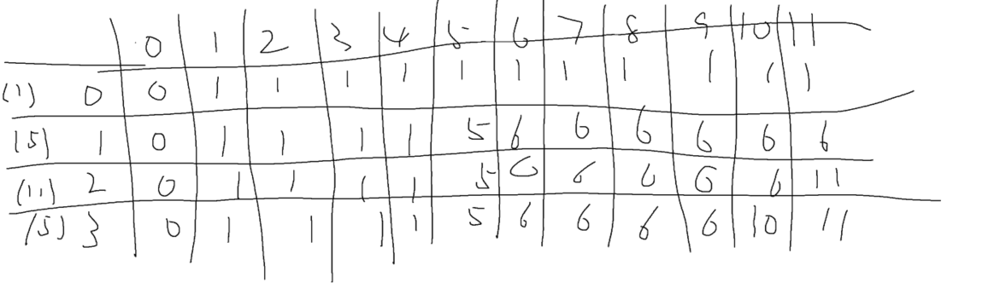

```java
class Solution {
    public boolean canPartition(int[] nums) {
        int totalsum = 0;
        for(int i : nums){
            totalsum += i;
        }
        
        if(totalsum%2!=0){
            return false;
        }
        
        int[][] dp = new int[nums.length][totalsum/2+1];
        
        for(int i = 0; i<dp[0].length; i++){
            dp[0][i] = 0;
            if(i>nums[0]){
                dp[0][i] = nums[0];
            }
        }
        
        for(int j = 1; j<dp.length; j++){
            for(int i = 0; i<dp[0].length; i++){
                
                if(i<nums[j]){
                    dp[j][i] = dp[j-1][i];
                }else{
                    dp[j][i] = Math.max(dp[j-1][i],dp[j-1][i-nums[j]]+nums[j]);
                }
                
                
            }
        }
        
        /*for(int i = 0;  i<dp.length; i++){
            for(int j = 0; j<dp[0].length; j++){
                System.out.print(dp[i][j]);
                System.out.print('.');
            }
            System.out.println('-');
        }*/
        
        
        if(dp[dp.length-1][dp[0].length-1]==totalsum/2){
            return true;
        }else{
            return false;
        }
    }
}
```

一维dp

```JAVA
class Solution {
    public boolean canPartition(int[] nums) {
        int sum = 0;
        for(int i : nums){
            sum += i;
        }
        if(sum%2!=0){
            return false;
        }
        int[] dp = new int[sum/2+1];
        
        //dp[0] = 0;
        
        for(int i = 0; i<nums.length; i++){
            for(int j = dp.length-1; j>=0; j--){
                if(j<nums[i]){
                    dp[j] = dp[j];
                }else{
                    dp[j] = Math.max(dp[j],dp[j-nums[i]]+nums[i]);
                }
            }
        }
        
        /*for(int i : dp){
            System.out.print(i);
            System.out.print('.');
        }*/
        
        if(dp[dp.length-1]==sum/2){
            return true;
        }else{
            return false;
        }
    }
}
```

## 1049. Last Stone Weight II

标准01背包

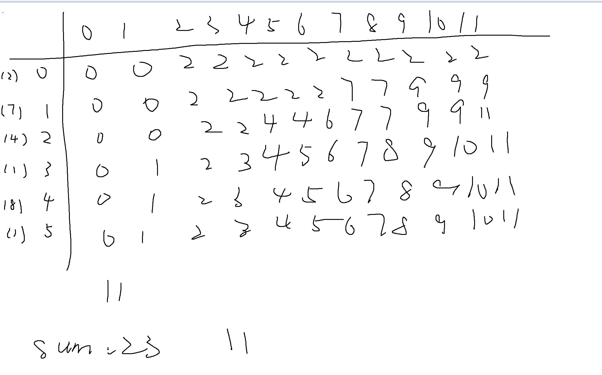

```java
class Solution {
    public int lastStoneWeightII(int[] stones) {
        int sum = 0;
        for(int i : stones){
            sum += i;
        }
        
        int target = sum/2;
        
        int[] dp = new int[target+1];
        
        for(int i = 0; i<stones.length; i++){
            
            for(int j = target; j>=0; j--){
                
                if(j>=stones[i]){
                    dp[j] = Math.max(dp[j], dp[j-stones[i]]+stones[i]);
                }
                
            }
            
        }
        
        for(int i : dp){
            System.out.print(i);
            System.out.print('.');
        }
        
        return sum-2*dp[dp.length-1];
        
    }
}
```

## 494. Target Sum

​    // 假设正数之和为x，负数之和为y
​    // x + y = sum;
​    // y = sum - x;
​    // x-(sum-x) = target
​    // x= (target+sum)/2

于是转换成了一个背包容量为(target+sum)/2的背包问题

背包中装的是方法

```java
class Solution {
    public int findTargetSumWays(int[] nums, int target) {
        int sum = 0;
        for(int i : nums){
            sum += i;
        }
        
        // 假设正数之和为x，负数之和为y
        // x + y = sum;
        // y = sum - x;
        // x-(sum-x) = target
        // x= (target+sum)/2
        
        if((target +sum)%2!=0){
            return 0;
        }
        
        int len = Math.abs(( target + sum ) / 2);
        
        
        
        int[] dp = new int[len+1];
        dp[0] = 1;
        for(int i = 0; i<nums.length; i++){
            for(int j = len; j>=nums[i]; j--){
                dp[j] = dp[j] + dp[j-nums[i]];
            }
        }   
        
        return dp[len];
    }
}
```

## 518. Coin Change 2

```Java
class Solution {
    public int change(int amount, int[] coins) {
        int[] dp = new int[amount+1]; 
        dp[0] = 1;
        
        for(int i = 0; i<coins.length; i++){
            for(int j = coins[i]; j<dp.length; j++){
                
                dp[j] = dp[j] + dp[j-coins[i]];
                
            }
            
            // for(int w = 0; w<dp.length; w++){
            //     System.out.print(dp[w]);
            //     System.out.print('.');
            // }
            // System.out.println("-");
        }
        
        
        return dp[dp.length-1];
    }
}
```

## 474. Ones and Zeroes

```java
class Solution {
    public int findMaxForm(String[] strs, int m, int n) {
        
        
        int[][] dp = new int [n+1][m+1];
        
        for(String s : strs){
            
            int zero = 0;
            int one = 0;
            
            for(int k = 0; k<s.length(); k++){
                if(s.charAt(k)=='0'){
                    zero++;
                }else{
                    one++;
                }
            }
            
            for(int i = n; i>=one; i--){
                for(int j = m; j>=zero; j--){
                    
                    dp[i][j] = Math.max(dp[i][j], dp[i-one][j-zero]+1);
                    
                }
            }
            
        }
        
        for(int i = 0; i<dp.length; i++){
            for(int j = 0; j<dp[0].length; j++){
                System.out.print(dp[i][j]);
                System.out.print('.');
            }
            System.out.println('-');
        }
        
        return dp[n][m];
        
    }
}
```

## 377. Combination Sum IV

这题是排列问题

对于排列问题，外层遍历背包，内层遍历数据

对于组合问题，外层遍历数组，内层遍历背包

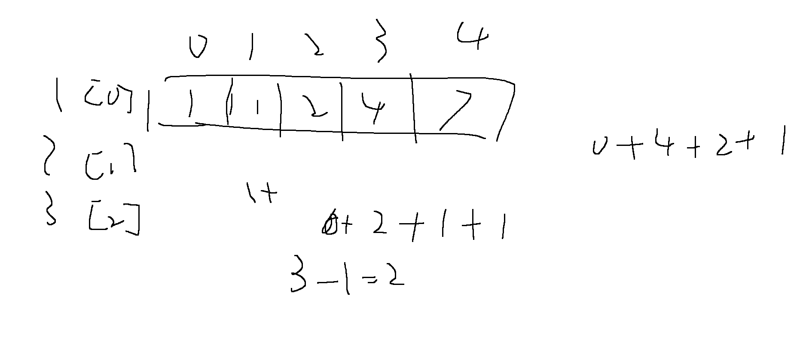

```java
class Solution {
    public int combinationSum4(int[] nums, int target) {
        int[] dp = new int[target+1];
        
        dp[0] = 1;
        
        for(int i = 0; i<dp.length; i++){
            
            for(int j = 0; j<nums.length; j++){
                
                if(i>=nums[j]){
                   dp[i] = dp[i] + dp[i-nums[j]]; 
                }

                
            }
            
            // for(int k: dp){
            //     System.out.print(k); 
            //     System.out.print('.'); 
            // }
            // System.out.println('-'); 
            
        }
        

            
        
        return dp[dp.length-1];
    }
    
    

}
```

## 70. Climbing Stairs

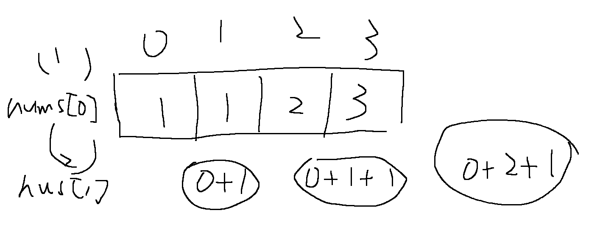

第二次爬楼梯，排列问题

```java
class Solution {
    public int climbStairs(int n) {
        int[] dp = new int[n+1];
        
        int[] nums = {1,2};

        dp[0] = 1;
        for(int i = 0; i<dp.length; i++){
            for(int j = 0; j<nums.length; j++){
                if(i>=nums[j]){
                   dp[i] = dp[i] + dp[i-nums[j]]; 
                }
            }
        }
        
            // for(int k: dp){
            //     System.out.print(k); 
            //     System.out.print('.'); 
            // }
            // System.out.println('-'); 
        
        return dp[dp.length-1];
        
    }
}
```

## 322. Coin Change

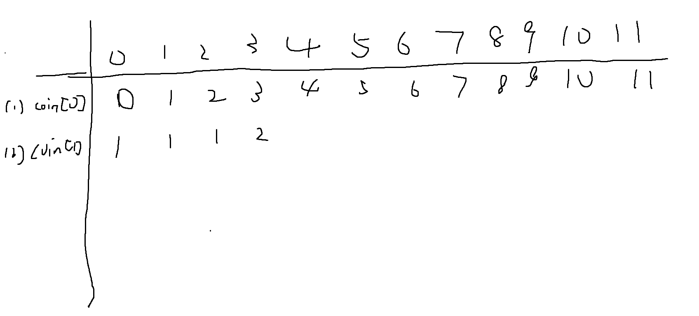

```java
class Solution {
    public int coinChange(int[] coins, int amount) {
        int[] dp =new int[amount+1];

        
        for(int i = 0; i<dp.length; i++){
            dp[i] = Integer.MAX_VALUE-1;
        }
        
        dp[0] = 0;
        
        for(int i = 0; i<coins.length; i++){
            for(int j = 0; j<dp.length; j++){
                
                if(j>=coins[i]){
                    dp[j] = Math.min(dp[j], dp[j-coins[i]]+1);
                }
                
            }
            
            // for(int k:dp){
            //     System.out.print(k);   
            //     System.out.print('.');  
            // }
            // System.out.println('-');
            
        }
        
        if(dp[dp.length-1]==Integer.MAX_VALUE-1){
            return -1;
        }else{
            return dp[dp.length-1]; 
        }
        
        //return dp[dp.length-1];
    }
}
```

## 279. Perfect Squares

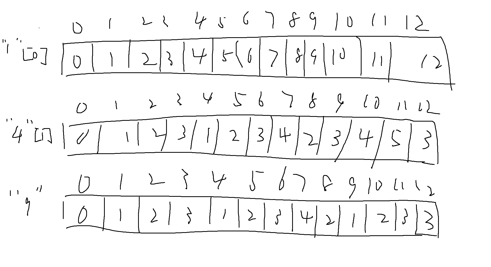

```java
class Solution {
    public int numSquares(int n) {
        int[] dp = new int[n+1];
        
        for(int i = 0; i<dp.length; i++){
            dp[i] = Integer.MAX_VALUE-1;
        }
        
        dp[0] = 0;
        

        
        for(int i = 1; i*i<=n; i++){
            for(int j = i*i; j<dp.length; j++){
                
                
                dp[j] = Math.min(dp[j], dp[j-i*i]+1);

              
            }
            

        }
            

        
        return dp[dp.length-1];

    }
}
```

# 打家劫舍

## 198. House Robber

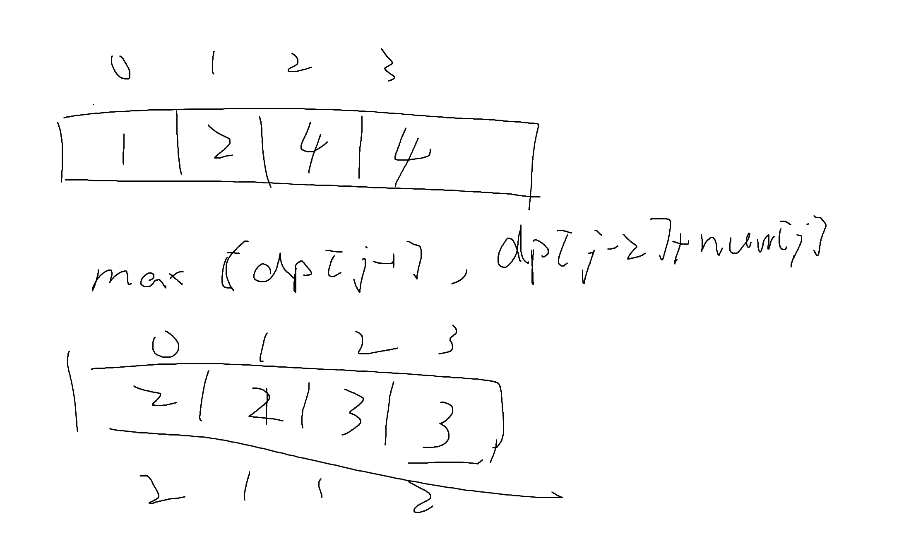

```java
class Solution {
    public int rob(int[] nums) {
        int[] dp = new int[nums.length];
        
        if(nums.length==1){
            return nums[0];
        }
        
        dp[0] = nums[0];
        dp[1] = Math.max(nums[0],nums[1]);
        
        
        for(int j = 2; j<nums.length; j++){
            
            dp[j] = Math.max(dp[j-1], dp[j-2]+nums[j]);
            
        }
        
        return dp[dp.length-1];
    }
}
```

## *337

# 股票问题

## 121. Best Time to Buy and Sell Stock

2. 确定递推公式

如果第i天持有股票即dp[i] [0]， 那么可以由两个状态推出来

* 第i-1天就持有股票，那么就保持现状，所得现金就是昨天持有股票的所得现金 即：dp[i - 1] [0]
* 第i天买入股票，所得现金就是买入今天的股票后所得现金即：-prices[i]

那么dp[i][0]应该选所得现金最大的，所以dp[i] [0] = max(dp[i - 1] [0], -prices[i]);

如果第i天不持有股票即dp[i] [1]， 也可以由两个状态推出来

* 第i-1天就不持有股票，那么就保持现状，所得现金就是昨天不持有股票的所得现金 即：dp[i - 1] [1]
* 第i天卖出股票，所得现金就是按照今天股票佳价格卖出后所得现金即：prices[i] + dp[i - 1] [0]

同样dp[i][1]取最大的，dp[i][1] = max(dp[i - 1] [1], prices[i] + dp[i - 1] [0]);

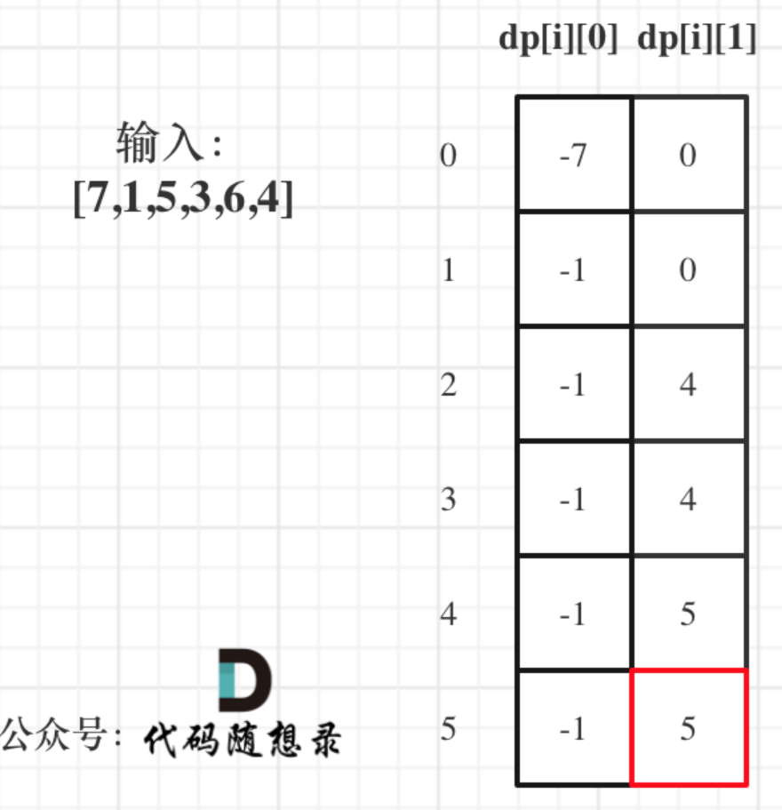

```java
class Solution {
    public int maxProfit(int[] prices) {
        int[][] dp =new int[prices.length][2];
        
        dp[0][0] = -prices[0];
        dp[0][1] = 0;
        
        
        for(int i = 1; i<prices.length; i++){
            
            dp[i][0] = Math.max(-prices[i], dp[i-1][0]);
            dp[i][1] = Math.max(prices[i]+dp[i-1][0], dp[i-1][1]);
            
        }
        
        return dp[prices.length-1][1];
        
    }
}
```

## 122. Best Time to Buy and Sell Stock II

这里重申一下dp数组的含义：

* dp[i][0] 表示第i天持有股票所得现金。
* dp[i][1] 表示第i天不持有股票所得最多现金


如果第i天持有股票即dp[i][0]， 那么可以由两个状态推出来 

* 第i-1天就持有股票，那么就保持现状，所得现金就是昨天持有股票的所得现金 即：dp[i - 1] [0]
* 第i天买入股票，所得现金就是昨天不持有股票的所得现金减去 今天的股票价格 即：dp[i - 1] [1] - prices[i] 

**注意这里和[121. 买卖股票的最佳时机](https://programmercarl.com/0121.买卖股票的最佳时机.html)唯一不同的地方，就是推导dp[i][0]的时候，第i天买入股票的情况**。

在[121. 买卖股票的最佳时机](https://programmercarl.com/0121.买卖股票的最佳时机.html)中，因为股票全程只能买卖一次，所以如果买入股票，那么第i天持有股票即dp[i] [0]一定就是 -prices[i]。

而本题，因为一只股票可以买卖多次，所以当第i天买入股票的时候，所持有的现金可能有之前买卖过的利润。

那么第i天持有股票即dp[i][0]，如果是第i天买入股票，所得现金就是昨天不持有股票的所得现金 减去 今天的股票价格 即：dp[i - 1] [1] - prices[i]。

在来看看如果第i天不持有股票即dp[i] [1]的情况， 依然可以由两个状态推出来

* 第i-1天就不持有股票，那么就保持现状，所得现金就是昨天不持有股票的所得现金 即：dp[i - 1] [1]
* 第i天卖出股票，所得现金就是按照今天股票佳价格卖出后所得现金即：prices[i] + dp[i - 1] [0] 

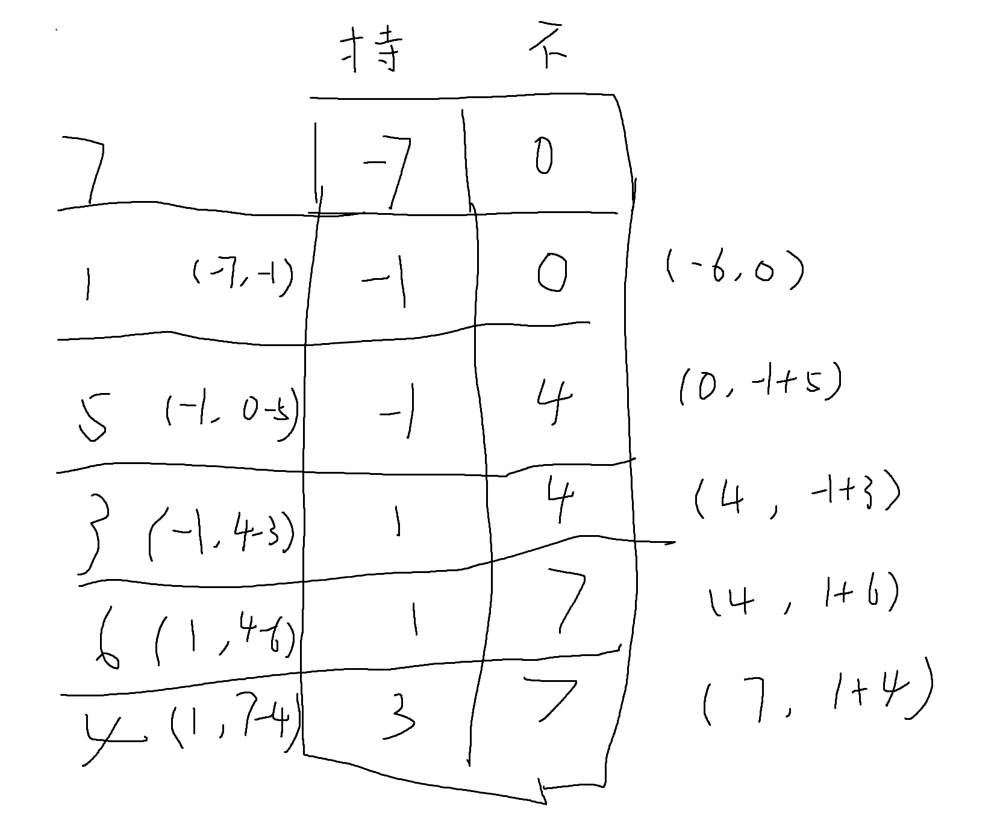

```java
class Solution {
    public int maxProfit(int[] prices) {
        int[][] dp = new int[prices.length][2];
        
        dp[0][0] = -prices[0];
        dp[0][1] = 0;
        
        
        for(int i = 1;  i<prices.length; i++){
            dp[i][0] = Math.max(dp[i-1][0], dp[i-1][1]-prices[i]);
            dp[i][1] = Math.max(dp[i-1][1], dp[i-1][0]+prices[i]);
        }
        
        return dp[dp.length-1][1];
        
    }
}
```

