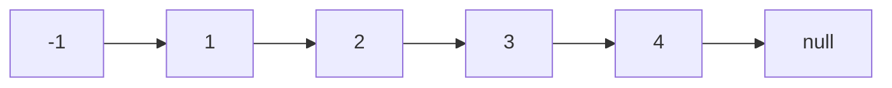
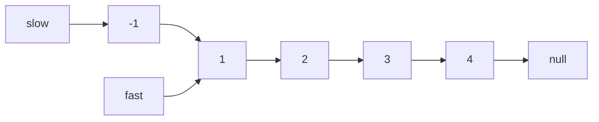
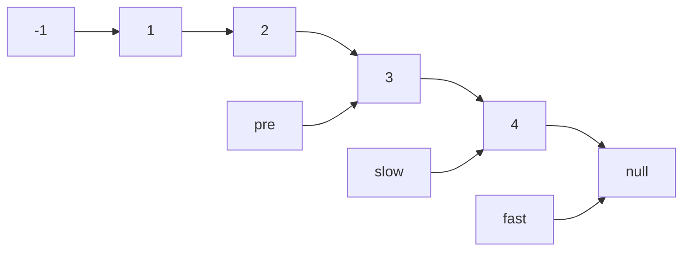
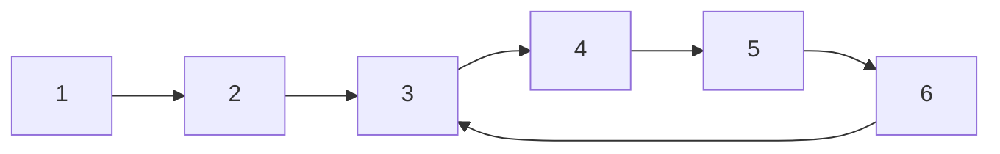

# 1.Arrays

## 704. Binary Search

Given an array of integers `nums` which is sorted in ascending order, and an integer `target`, write a function to search `target` in `nums`. If `target` exists, then return its index. Otherwise, return `-1`.

You must write an algorithm with `O(log n)` runtime complexity.

**Example 1:**

```
Input: nums = [-1,0,3,5,9,12], target = 9
Output: 4
Explanation: 9 exists in nums and its index is 4
```

**Example 2:**

```
Input: nums = [-1,0,3,5,9,12], target = 2
Output: -1
Explanation: 2 does not exist in nums so return -1
```

### Solution

```java
class Solution {
    public int search(int[] nums, int target) {
        if(nums[0]>target || nums[nums.length-1]<target){
            return -1;
        }
        
        int left = 0;
        int right = nums.length-1;
        int mid;
        while (left<=right){
            mid = left + (right-left)/2;
            if(nums[mid] < target){
                left++;
            }else if (nums[mid] > target){
                right--;
            }else{
                
                return mid;
            }
        }
        return -1;
    }
}
```

## 27. Remove Element

Given an integer array `nums` and an integer `val`, remove all occurrences of `val` in `nums` [**in-place**](https://en.wikipedia.org/wiki/In-place_algorithm). The relative order of the elements may be changed.

Since it is impossible to change the length of the array in some languages, you must instead have the result be placed in the **first part** of the array `nums`. More formally, if there are `k` elements after removing the duplicates, then the first `k` elements of `nums` should hold the final result. It does not matter what you leave beyond the first `k` elements.

Return `k` *after placing the final result in the first* `k` *slots of* `nums`.

Do **not** allocate extra space for another array. You must do this by **modifying the input array [in-place](https://en.wikipedia.org/wiki/In-place_algorithm)** with O(1) extra memory.

**Custom Judge:**

The judge will test your solution with the following code:

```
int[] nums = [...]; // Input array
int val = ...; // Value to remove
int[] expectedNums = [...]; // The expected answer with correct length.
                            // It is sorted with no values equaling val.

int k = removeElement(nums, val); // Calls your implementation

assert k == expectedNums.length;
sort(nums, 0, k); // Sort the first k elements of nums
for (int i = 0; i < actualLength; i++) {
    assert nums[i] == expectedNums[i];
}
```

If all assertions pass, then your solution will be **accepted**.

 

**Example 1:**

```
Input: nums = [3,2,2,3], val = 3
Output: 2, nums = [2,2,_,_]
Explanation: Your function should return k = 2, with the first two elements of nums being 2.
It does not matter what you leave beyond the returned k (hence they are underscores).
```

**Example 2:**

```
Input: nums = [0,1,2,2,3,0,4,2], val = 2
Output: 5, nums = [0,1,4,0,3,_,_,_]
Explanation: Your function should return k = 5, with the first five elements of nums containing 0, 0, 1, 3, and 4.
Note that the five elements can be returned in any order.
It does not matter what you leave beyond the returned k (hence they are underscores).
```

### Solution

```java
class Solution {
    public int removeElement(int[] nums, int val) {
        int fastIndex=0;
        int slowIndex=0;
        for(;fastIndex<nums.length;fastIndex++){
            if(nums[fastIndex]!=val){
                nums[slowIndex] = nums[fastIndex];  
                slowIndex++;
            }

        }
        
        return slowIndex;
    }
}
```

Input [0,1,3,3,5,7] val=3

1 fast = 0 nums[fast]=0, !=3

2 fast=1 slow=2

3 fast=2 skip slow =2

4 fast = 3 skip slow =2

5 fast = 4, 5->2

## 977. Squares of a Sorted Array

Given an integer array `nums` sorted in **non-decreasing** order, return *an array of **the squares of each number** sorted in non-decreasing order*.

**Example 1:**

```
Input: nums = [-4,-1,0,3,10]
Output: [0,1,9,16,100]
Explanation: After squaring, the array becomes [16,1,0,9,100].
After sorting, it becomes [0,1,9,16,100].
```

**Example 2:**

```
Input: nums = [-7,-3,2,3,11]
Output: [4,9,9,49,121]
```

### Solution

#### 暴力循环排序

```java
class Solution {
    public int[] sortedSquares(int[] nums) {
        for(int i=0; i< nums.length; i++){
            nums[i] = nums[i]*nums[i];
        }
        
        Arrays.sort(nums);
        return nums;
    }
}
```

#### 双指针

```java
class Solution {
    public int[] sortedSquares(int[] nums) {
        int[] res = new int[nums.length];
        int left = 0;
        int right = nums.length-1;
        
        
        for(int i=nums.length-1;i>=0;i--){
            if(nums[left]*nums[left]<=nums[right]*nums[right]){
                res[i]=nums[right]*nums[right];
                right--;
            }else if (nums[left]*nums[left]>nums[right]*nums[right]){
                res[i]=nums[left]*nums[left];
                left++;
            }
        }
        return res;
            
        
    }
}
```

## 209. Minimum Size Subarray Sum

Given an array of positive integers `nums` and a positive integer `target`, return the minimal length of a **contiguous subarray** `[numsl, numsl+1, ..., numsr-1, numsr]` of which the sum is greater than or equal to `target`. If there is no such subarray, return `0` instead.

 

**Example 1:**

```
Input: target = 7, nums = [2,3,1,2,4,3]
Output: 2
Explanation: The subarray [4,3] has the minimal length under the problem constraint.
```

**Example 2:**

```
Input: target = 4, nums = [1,4,4]
Output: 1
```

**Example 3:**

```
Input: target = 11, nums = [1,1,1,1,1,1,1,1]
Output: 0
```

### Solution

滑动窗口，核心思路 sum-=nums[left++]

return res == Integer.MAX_VALUE ? 0 : res;

```java
class Solution {
    public int minSubArrayLen(int target, int[] nums) {
        
        int left = 0;
        int right = 0;
        int sum=0;
        int res= Integer.MAX_VALUE;
        
        for(;right<nums.length;right++){
            sum += nums[right];
            
            while(sum>=target){
                res = Math.min(res,right-left+1);
                sum -= nums[left++];
            }
                
        }
        
        return res == Integer.MAX_VALUE ? 0 : res;
    }
}
```

## *59. Spiral Matrix II

Given a positive integer `n`, generate an `n x n` `matrix` filled with elements from `1` to `n2` in spiral order.

 

**Example 1:**


```
Input: n = 3
Output: [[1,2,3],[8,9,4],[7,6,5]]
```

**Example 2:**

```
Input: n = 1
Output: [[1]]
```

### Solution

```java
class Solution {
    public int[][] generateMatrix(int n) {
        int[][] res = new int[n][n];

        // 循环次数
        int loop = n / 2;

        // 定义每次循环起始位置
        int startX = 0;
        int startY = 0;

        // 定义偏移量
        int offset = 1;

        // 定义填充数字
        int count = 1;

        // 定义中间位置
        int mid = n / 2;
        while (loop > 0) {
            int i = startX;
            int j = startY;

            // 模拟上侧从左到右
            for (; j<startY + n -offset; ++j) {
                res[startX][j] = count++;
            }

            // 模拟右侧从上到下
            for (; i<startX + n -offset; ++i) {
                res[i][j] = count++;
            }

            // 模拟下侧从右到左
            for (; j > startY; j--) {
                res[i][j] = count++;
            }

            // 模拟左侧从下到上
            for (; i > startX; i--) {
                res[i][j] = count++;
            }

            loop--;

            startX += 1;
            startY += 1;

            offset += 2;
        }

        if (n % 2 == 1) {
            res[mid][mid] = count;
        }

        return res;
    }
}
```


# 2.Linked list

## 203. Remove Linked List Elements

Given the `head` of a linked list and an integer `val`, remove all the nodes of the linked list that has `Node.val == val`, and return *the new head*.

 

**Example 1:**


```
Input: head = [1,2,6,3,4,5,6], val = 6
Output: [1,2,3,4,5]
```

**Example 2:**

```
Input: head = [], val = 1
Output: []
```

**Example 3:**

```
Input: head = [7,7,7,7], val = 7
Output: []
```

###  Solution

#### 虚拟节点

```java
/**
 * Definition for singly-linked list.
 * public class ListNode {
 *     int val;
 *     ListNode next;
 *     ListNode() {}
 *     ListNode(int val) { this.val = val; }
 *     ListNode(int val, ListNode next) { this.val = val; this.next = next; }
 * }
 */
class Solution {
    public ListNode removeElements(ListNode head, int val) {
        ListNode dummynode = new ListNode(-1, head);
        ListNode pre = dummynode;
        ListNode cur = head;
        
        
        if(head == null){
            return head;
        }
        while(cur!=null){
            
            

            if(cur.val != val){
                pre = cur;
            }else if(cur.val == val){
                pre.next = cur.next;
            }
            
            cur = cur.next;
            
        }
        
        return dummynode.next;
    }
}
```

## 707. Design Linked List

Design your implementation of the linked list. You can choose to use a singly or doubly linked list.
A node in a singly linked list should have two attributes: `val` and `next`. `val` is the value of the current node, and `next` is a pointer/reference to the next node.
If you want to use the doubly linked list, you will need one more attribute `prev` to indicate the previous node in the linked list. Assume all nodes in the linked list are **0-indexed**.

Implement the `MyLinkedList` class:

- `MyLinkedList()` Initializes the `MyLinkedList` object.
- `int get(int index)` Get the value of the `indexth` node in the linked list. If the index is invalid, return `-1`.
- `void addAtHead(int val)` Add a node of value `val` before the first element of the linked list. After the insertion, the new node will be the first node of the linked list.
- `void addAtTail(int val)` Append a node of value `val` as the last element of the linked list.
- `void addAtIndex(int index, int val)` Add a node of value `val` before the `indexth` node in the linked list. If `index` equals the length of the linked list, the node will be appended to the end of the linked list. If `index` is greater than the length, the node **will not be inserted**.
- `void deleteAtIndex(int index)` Delete the `indexth` node in the linked list, if the index is valid.

 

**Example 1:**

```
Input
["MyLinkedList", "addAtHead", "addAtTail", "addAtIndex", "get", "deleteAtIndex", "get"]
[[], [1], [3], [1, 2], [1], [1], [1]]
Output
[null, null, null, null, 2, null, 3]

Explanation
MyLinkedList myLinkedList = new MyLinkedList();
myLinkedList.addAtHead(1);
myLinkedList.addAtTail(3);
myLinkedList.addAtIndex(1, 2);    // linked list becomes 1->2->3
myLinkedList.get(1);              // return 2
myLinkedList.deleteAtIndex(1);    // now the linked list is 1->3
myLinkedList.get(1);              // return 3
```

### Solution

```java
class ListNode{
    
    int val;
    ListNode next;
    
    ListNode(){}
    
    ListNode(int val){
        this.val = val;
    }
    ListNode(int val, ListNode next){
        this.val = val;
        this.next = next;
    }
    
}


class MyLinkedList {

    //dummy head
    ListNode head;
    int size;
    
    public MyLinkedList() {
        head = new ListNode(-1);
        size = 0;
    }
    
    public int get(int index) {
       
        if(index<0 || index >=size){
            return -1;
        }
        ListNode cur = head;
        for(int i=0; i<=index; i++){
            cur = cur.next;
        }
        return cur.val;
    }
    
    public void addAtHead(int val) {
        
        
        addAtIndex(0,val);
    }
    
    public void addAtTail(int val) {
        addAtIndex(size,val);
    }
    
    public void addAtIndex(int index, int val) {
        
        
        
        if( index < 0 || index > size ){
           return; 
        }
        
        size ++;
        
        ListNode pre = head;
        for(int i=0; i<index; i++){
            pre = pre.next;
        }
        
        ListNode addAt = new ListNode(val);
        addAt.next = pre.next;
        pre.next = addAt;
        
    }
    
    public void deleteAtIndex(int index) {
        
        if( index < 0 || index >= size ){
           return; 
        }
        
        size--;
        
        ListNode pre = head;
        for(int i=0; i<index; i++){
            pre = pre.next;
        }
        
        pre.next = pre.next.next;
    }
}

/**
 * Your MyLinkedList object will be instantiated and called as such:
 * MyLinkedList obj = new MyLinkedList();
 * int param_1 = obj.get(index);
 * obj.addAtHead(val);
 * obj.addAtTail(val);
 * obj.addAtIndex(index,val);
 * obj.deleteAtIndex(index);
 */
```

## 206. Reverse Linked List

Given the `head` of a singly linked list, reverse the list, and return *the reversed list*.

 

**Example 1:**


```
Input: head = [1,2,3,4,5]
Output: [5,4,3,2,1]
```

**Example 2:**


```
Input: head = [1,2]
Output: [2,1]
```

**Example 3:**

```
Input: head = []
Output: []
```

### Solution:

#### 单链表反转

```java
/**
 * Definition for singly-linked list.
 * public class ListNode {
 *     int val;
 *     ListNode next;
 *     ListNode() {}
 *     ListNode(int val) { this.val = val; }
 *     ListNode(int val, ListNode next) { this.val = val; this.next = next; }
 * }
 */
class Solution {
    public ListNode reverseList(ListNode head) {
        ListNode pre = null;
        ListNode cur = head;
        ListNode temp = null;
        
        
        while(cur != null){
            temp = cur.next;
            cur.next = pre;
            pre = cur;
            cur = temp;
            
        }
        
        return pre;
    }
}
```

## 24. Swap Nodes in Pairs

Given a linked list, swap every two adjacent nodes and return its head. You must solve the problem without modifying the values in the list's nodes (i.e., only nodes themselves may be changed.)

 

**Example 1:**


```
Input: head = [1,2,3,4]
Output: [2,1,4,3]
```

**Example 2:**

```
Input: head = []
Output: []
```

**Example 3:**

```
Input: head = [1]
Output: [1]
```


## 19. Remove Nth Node From End of List

Given the `head` of a linked list, remove the `nth` node from the end of the list and return its head.

 

**Example 1:**


```
Input: head = [1,2,3,4,5], n = 2
Output: [1,2,3,5]
```

**Example 2:**

```
Input: head = [1], n = 1
Output: []
```

**Example 3:**

```
Input: head = [1,2], n = 1
Output: [1]
```

###  Solution:

移除倒数第**2**个[3]



fast先动**2**轮



fast动到null slow动到要删除的位子 pre是slow前一个




```java
/**
 * Definition for singly-linked list.
 * public class ListNode {
 *     int val;
 *     ListNode next;
 *     ListNode() {}
 *     ListNode(int val) { this.val = val; }
 *     ListNode(int val, ListNode next) { this.val = val; this.next = next; }
 * }
 */
class Solution {
    public ListNode removeNthFromEnd(ListNode head, int n) {

        ListNode dummyNode = new ListNode(-1, head);
        ListNode fast = dummyNode;
        ListNode slow = dummyNode;
        
        for(int i=0; i<n; i++){
            fast = fast.next;
        }        
        ListNode pre = null;
        while(fast != null){
            pre = slow;
            fast = fast.next;
            slow = slow.next;
        }
        
        
        pre.next = slow.next;
        slow.next = null;
        
        
        return dummyNode.next;
        
        
    }
}
```

## 160. Intersection of Two Linked Lists

Given the heads of two singly linked-lists `headA` and `headB`, return *the node at which the two lists intersect*. If the two linked lists have no intersection at all, return `null`.

For example, the following two linked lists begin to intersect at node `c1`:


The test cases are generated such that there are no cycles anywhere in the entire linked structure.

**Note** that the linked lists must **retain their original structure** after the function returns.

**Custom Judge:**

The inputs to the **judge** are given as follows (your program is **not** given these inputs):

- `intersectVal` - The value of the node where the intersection occurs. This is `0` if there is no intersected node.
- `listA` - The first linked list.
- `listB` - The second linked list.
- `skipA` - The number of nodes to skip ahead in `listA` (starting from the head) to get to the intersected node.
- `skipB` - The number of nodes to skip ahead in `listB` (starting from the head) to get to the intersected node.

The judge will then create the linked structure based on these inputs and pass the two heads, `headA` and `headB` to your program. If you correctly return the intersected node, then your solution will be **accepted**.

 

**Example 1:**


```
Input: intersectVal = 8, listA = [4,1,8,4,5], listB = [5,6,1,8,4,5], skipA = 2, skipB = 3
Output: Intersected at '8'
Explanation: The intersected node's value is 8 (note that this must not be 0 if the two lists intersect).
From the head of A, it reads as [4,1,8,4,5]. From the head of B, it reads as [5,6,1,8,4,5]. There are 2 nodes before the intersected node in A; There are 3 nodes before the intersected node in B.
```

**Example 2:**


```
Input: intersectVal = 2, listA = [1,9,1,2,4], listB = [3,2,4], skipA = 3, skipB = 1
Output: Intersected at '2'
Explanation: The intersected node's value is 2 (note that this must not be 0 if the two lists intersect).
From the head of A, it reads as [1,9,1,2,4]. From the head of B, it reads as [3,2,4]. There are 3 nodes before the intersected node in A; There are 1 node before the intersected node in B.
```

**Example 3:**


```
Input: intersectVal = 0, listA = [2,6,4], listB = [1,5], skipA = 3, skipB = 2
Output: No intersection
Explanation: From the head of A, it reads as [2,6,4]. From the head of B, it reads as [1,5]. Since the two lists do not intersect, intersectVal must be 0, while skipA and skipB can be arbitrary values.
Explanation: The two lists do not intersect, so return null.
```

### Solution:

计算两个链表的差值，之后fast挪动差值，再找相同。

```java
/**
 * Definition for singly-linked list.
 * public class ListNode {
 *     int val;
 *     ListNode next;
 *     ListNode(int x) {
 *         val = x;
 *         next = null;
 *     }
 * }
 */
public class Solution {
    public ListNode getIntersectionNode(ListNode headA, ListNode headB) {
        ListNode A = headA;
        ListNode B = headB;
        
        int lenA = 0;
        int lenB =0;
        
        while(A!=null){
            lenA++;
            A = A.next;
        }
        while(B!=null){
            lenB++;
            B = B.next;
        }
        
        int dif = lenA - lenB;
        if(dif<0){
            A = headB;
            B = headA;
            dif = dif*-1;
        }else{
            A = headA;
            B = headB;
        }

        for(int i=0; i<dif ;i++){
            A = A.next;
        }
        
        while(A!=null){
            
            if(A == B){
                return A;
            }
            A = A.next;
            B = B.next;
        }
        
        return null;
    }
}
```

## 142. Linked List Cycle II

Given the `head` of a linked list, return *the node where the cycle begins. If there is no cycle, return* `null`.

There is a cycle in a linked list if there is some node in the list that can be reached again by continuously following the `next` pointer. Internally, `pos` is used to denote the index of the node that tail's `next` pointer is connected to (**0-indexed**). It is `-1` if there is no cycle. **Note that** `pos` **is not passed as a parameter**.

**Do not modify** the linked list.

 

**Example 1:**


```
Input: head = [3,2,0,-4], pos = 1
Output: tail connects to node index 1
Explanation: There is a cycle in the linked list, where tail connects to the second node.
```

**Example 2:**


```
Input: head = [1,2], pos = 0
Output: tail connects to node index 0
Explanation: There is a cycle in the linked list, where tail connects to the first node.
```

**Example 3:**


```
Input: head = [1], pos = -1
Output: no cycle
Explanation: There is no cycle in the linked list.
```

 

**Constraints:**

- The number of the nodes in the list is in the range `[0, 104]`.
- `-105 <= Node.val <= 105`
- `pos` is `-1` or a **valid index** in the linked-list.

### Solution

fast指针比slow指针快一步，这样就能相遇




```java
/**
 * Definition for singly-linked list.
 * class ListNode {
 *     int val;
 *     ListNode next;
 *     ListNode(int x) {
 *         val = x;
 *         next = null;
 *     }
 * }
 */
public class Solution {
    public ListNode detectCycle(ListNode head) {
        ListNode fast = head;
        ListNode slow = head;
        
        if( head == null ){
            return null;
        }
        
        while(fast!= null && fast.next !=null){
            
            fast = fast.next.next;
            slow = slow.next;
            if(fast == slow){
                ListNode index1 = head;
                ListNode index2 = fast;
                while(index1 != index2){
                    index1 = index1.next;
                    index2 = index2.next;
                }
                return index1;
            }
            
        }
    
        return null;
    }
}
```

## 1002.Find Common Characters

Given a string array `words`, return *an array of all characters that show up in all strings within the* `words` *(including duplicates)*. You may return the answer in **any order**.

 

**Example 1:**

```
Input: words = ["bella","label","roller"]
Output: ["e","l","l"]
```

**Example 2:**

```
Input: words = ["cool","lock","cook"]
Output: ["c","o"]
```

### Solution

```java
class Solution {
    public List<String> commonChars(String[] words) {
         
        int[] aph = new int[26];
        
        
        if(words == null){
            return null;
        }
        
        String firstStr = words[0];
        for(int i=0; i<firstStr.length();i++){
            aph[firstStr.charAt(i)-'a']++;  
        }     
        
        
        for(String str : words){
            
            int[] temp = new int[26];
            for(int i=0; i<str.length();i++){    
                temp[str.charAt(i)-'a']++;       
            }  
            
            for(int k=0; k<26; k++){
                aph[k] = Math.min(temp[k],aph[k]);
            }
            //aph[str.charAt(i)-'a'] = Math.min(temp[str.charAt(i)-'a'],aph[str.charAt(i)-'a']);
         }   
        
        List<String> result = new ArrayList<>();
        
        for( int i=0; i<26; i++){
            
            while(aph[i]!=0){
                char c = (char)(i+'a');
                String str = String.valueOf(c);
                result.add(str);
                aph[i] --;
            }
        }
        return result;
        
    }
}
```

